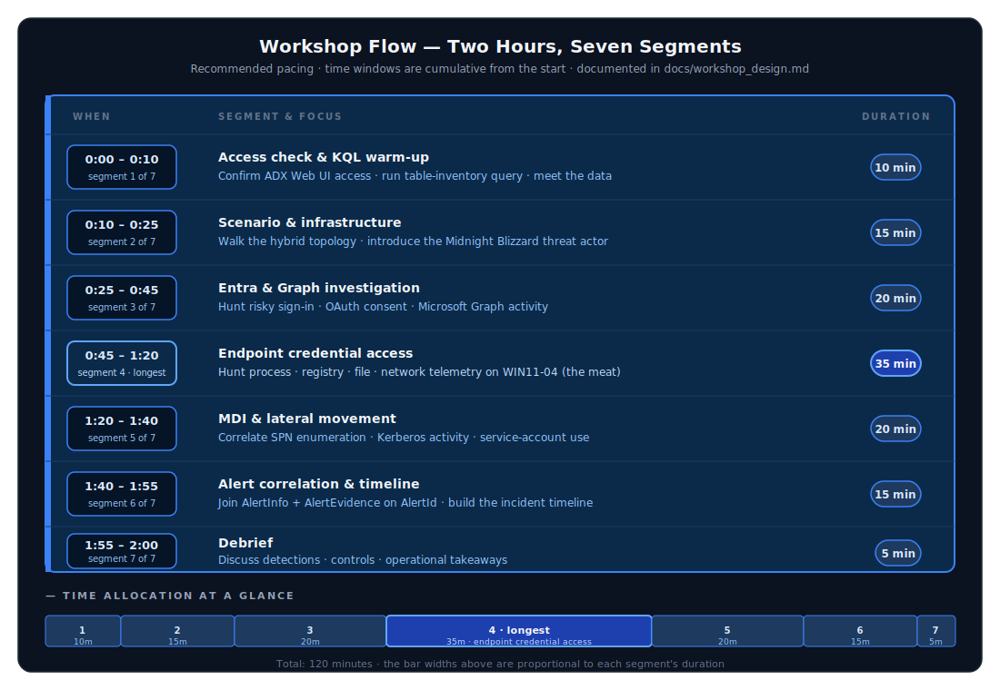
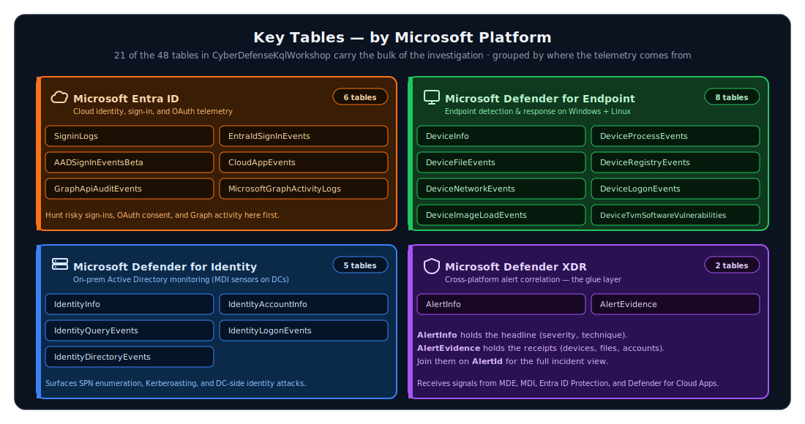

# 🚀 Cyber Defense KQL Workshop for Azure Data Explorer (ADX)

## Description

This repository contains a complete two-hour cyber defense workshop package for teaching KQL-driven investigation in Azure Data Explorer (ADX). The workshop uses synthetic Microsoft security telemetry loaded into an ADX database so students can investigate a realistic hybrid identity and endpoint intrusion without needing live production infrastructure.

The lab is designed for **20 students** using the **ADX Web UI** with username/password sign-in and TAP or SMS MFA. Students query Microsoft Defender XDR-style, Microsoft Defender for Endpoint (MDE), Microsoft Defender for Identity (MDI), Microsoft Entra ID, Microsoft Graph, sign-in, cloud app, and alert telemetry.

## Purpose

The purpose of this workshop is to help defenders learn how to:

1. Use KQL to orient across ADX tables that mirror Microsoft security data sources.
2. Correlate endpoint, identity, cloud, Graph, sign-in, and alert evidence.
3. Build an investigation timeline from multiple telemetry sources.
4. Map observed attack behavior to MITRE ATT&CK techniques.
5. Understand which Microsoft telemetry tables illuminate specific credential-access behaviors.

## Prerequisites

To deploy and run the workshop, you need:

- ☁️ An existing ADX cluster
- 🔐 Azure permissions to create or manage an ADX database
- 🧭 ADX database admin permissions for table creation and ingestion
- 👥 Entra permissions for student user/group/TAP creation if using the identity helper script
- 🖥️ PowerShell 7 with the Azure, Kusto, and Microsoft Graph modules installed
- ⚙️ Azure CLI installed for fallback token acquisition and operational troubleshooting

### 🖥️ Terminal (CLI) install commands

Install PowerShell 7 silently / non-interactively from Windows Terminal, Command Prompt, or an existing PowerShell session:

```powershell
winget install --id Microsoft.PowerShell --source winget --silent --accept-package-agreements --accept-source-agreements
```

After PowerShell 7 installs, open a new **PowerShell 7** terminal and install the required modules:

```powershell
Install-Module -Name Az -Repository PSGallery -Scope CurrentUser -Force
Install-Module -Name Az.Kusto -Repository PSGallery -Scope CurrentUser -Force
Install-Module -Name Microsoft.Graph -Repository PSGallery -Scope CurrentUser -Force
```

Install Azure CLI silently / non-interactively:

```powershell
winget install --id Microsoft.AzureCLI --source winget --silent --accept-package-agreements --accept-source-agreements
```

Close and reopen the terminal after installing PowerShell 7 or Azure CLI.

### 🔗 Official install references

- PowerShell 7 on Windows: <https://learn.microsoft.com/powershell/scripting/install/installing-powershell-on-windows>
- Azure PowerShell Az module: <https://learn.microsoft.com/powershell/azure/install-azure-powershell>
- Az.Kusto module reference: <https://learn.microsoft.com/powershell/module/az.kusto/>
- Azure CLI on Windows: <https://learn.microsoft.com/cli/azure/install-azure-cli-windows>
- Microsoft Graph PowerShell SDK: <https://learn.microsoft.com/microsoftgraph/installation>

## Cyber Defense Scenario summary

The Cyber Defense scenario models a **Midnight Blizzard-inspired hybrid identity credential-access intrusion** against a notional organization named Wiesbaden Research. The intrusion begins with a risky Entra sign-in, suspicious OAuth consent, and Microsoft Graph activity — tradecraft that Midnight Blizzard (also tracked as APT29 / Cozy Bear / SVR-attributed) used in the real-world Microsoft and HPE breaches in 2023–2024. From there it pivots to a compromised Windows endpoint where the attacker performs credential-access activity, and the attack path later touches domain controller telemetry and service-account activity against the Entra Connect server.

The diagram below traces the kill chain across the cloud, endpoint, and identity tiers. Each phase deposits telemetry into Azure Data Explorer for student investigation.


For background on the threat actor that inspired this scenario — naming, attribution, recent activity, and the TTPs that map directly to the workshop's KQL queries — see [`docs/threat-actor-midnight-blizzard.md`](docs/threat-actor-midnight-blizzard.md).

Notional infrastructure:

- 2 domain controllers with MDI
- 10 Windows 11 25H2 endpoints with MDE
- 5 Ubuntu Linux endpoints with MDE
- 1 Entra Connect server with MDI/MDE-relevant identity telemetry
- Hybrid Active Directory and Microsoft Entra ID environment

The screenshot attack vectors are covered and mapped to MITRE ATT&CK, including `T1552.002`, `T1003.002`, `T1555.003`, `T1558.003`, `T1003.001`, and `T1555`.

## Artifact index

| Area | Purpose | Primary files |
| --- | --- | --- |
| ADX setup | Creates the ADX database tables, JSON ingestion mappings, generated telemetry, and ingestion flow | [`scripts\Initialize-Workshop.ps1`](scripts/Initialize-Workshop.ps1), [`scripts\Initialize-AdxTables.ps1`](scripts/Initialize-AdxTables.ps1), [`scripts\Import-SyntheticTelemetry.ps1`](scripts/Import-SyntheticTelemetry.ps1), [`scripts\AdxWorkshop.Common.psm1`](scripts/AdxWorkshop.Common.psm1) |
| Schemas | Holds one Microsoft Learn-derived JSON schema file per ADX table | [`schemas\`](schemas/), [`metadata\tables.manifest.json`](metadata/tables.manifest.json), [`tools\Build-SchemasFromMicrosoftLearn.ps1`](tools/Build-SchemasFromMicrosoftLearn.ps1) |
| Synthetic data | Holds generated schema-aligned NDJSON telemetry files | [`data\generated\`](data/generated/), [`data\scenario-summary.json`](data/scenario-summary.json), [`scripts\New-SyntheticTelemetry.ps1`](scripts/New-SyntheticTelemetry.ps1) |
| Student access | Creates or stages student users, TAP values, group access, and ADX viewer permissions | [`scripts\New-WorkshopStudents.ps1`](scripts/New-WorkshopStudents.ps1), [`scripts\Grant-StudentAdxAccess.ps1`](scripts/Grant-StudentAdxAccess.ps1), [`docs\student_access.md`](docs/student_access.md) |
| Scenario and MITRE | Documents the threat actor framing, infrastructure, and attack-vector to ATT&CK mapping | [`docs\threat-actor-midnight-blizzard.md`](docs/threat-actor-midnight-blizzard.md), [`metadata\mitre-attack-mapping.json`](metadata/mitre-attack-mapping.json), [`data\scenario-summary.json`](data/scenario-summary.json), [`docs\workshop_design.md`](docs/workshop_design.md) |
| Workshop content | Provides the student lab, instructor guide, design notes, and diagrams | [`workshop\student_lab.kql`](workshop/student_lab.kql), [`docs\instructor_guide.md`](docs/instructor_guide.md), [`docs\workshop_design.md`](docs/workshop_design.md), [`docs\diagrams.md`](docs/diagrams.md) |
| Slides | Provides an instructor-led slide outline and a PowerPoint generator for Windows systems with PowerPoint installed | [`workshop\slide_deck_outline.md`](workshop/slide_deck_outline.md), [`scripts\New-WorkshopDeck.ps1`](scripts/New-WorkshopDeck.ps1) |
| Validation | Validates PowerShell syntax, schemas, and generated telemetry alignment | [`scripts\Test-WorkshopPackage.ps1`](scripts/Test-WorkshopPackage.ps1) |

## Quick start

Run these commands from the repository root.

### 1. Refresh table schemas from Microsoft Learn

The repository already includes generated schemas. Use this command only when you want to refresh them from Microsoft Learn.

```powershell
.\tools\Build-SchemasFromMicrosoftLearn.ps1 -Force
```

### 2. Create the ADX database, tables, mappings, synthetic telemetry, and ingest data

```powershell
.\scripts\Initialize-Workshop.ps1 `
  -ResourceGroupName '<resource-group>' `
  -ClusterName '<adx-cluster-name>' `
  -DatabaseName 'CyberDefenseKqlWorkshop' `
  -ForceRecreateTables
```

If the database already exists and you only need to create tables and load data:

```powershell
.\scripts\Initialize-Workshop.ps1 `
  -ResourceGroupName '<resource-group>' `
  -ClusterName '<adx-cluster-name>' `
  -ClusterUri 'https://<cluster>.<region>.kusto.windows.net' `
  -DatabaseName 'CyberDefenseKqlWorkshop' `
  -SkipDatabaseCreate `
  -ForceRecreateTables
```

### 3. Create or stage student identities

Create the CSV roster only:

```powershell
.\scripts\New-WorkshopStudents.ps1 `
  -TenantDomain '<tenant-domain>' `
  -InitialPassword '<temporary-password>'
```

Create cloud-only users, a student security group, and Temporary Access Pass values:

```powershell
.\scripts\New-WorkshopStudents.ps1 `
  -TenantDomain '<tenant-domain>' `
  -InitialPassword '<temporary-password>' `
  -CreateUsers `
  -CreateTemporaryAccessPass
```

Grant ADX database viewer access to the student group:

```powershell
.\scripts\Grant-StudentAdxAccess.ps1 `
  -ClusterUri 'https://<cluster>.<region>.kusto.windows.net' `
  -DatabaseName 'CyberDefenseKqlWorkshop' `
  -GroupObjectId '<student-group-object-id>'
```

### 4. Give students the ADX Web UI URL

```text
https://dataexplorer.azure.com/clusters/<cluster>.<region>.kusto.windows.net/databases/CyberDefenseKqlWorkshop
```

Students should sign in with their workshop username/password and complete MFA using TAP or SMS.

### 5. Import the ADX SOC threat protection dashboard

The repository includes an Azure Data Explorer dashboard template with a SOC-style landing page plus drilldown pages for identity/sign-ins, network/Graph activity, alert timeline review, and inventory/posture:

```powershell
.\scripts\New-WorkshopDashboard.ps1 `
  -ClusterUri 'https://<cluster>.<region>.kusto.windows.net' `
  -DatabaseName 'CyberDefenseKqlWorkshop'
```

In the ADX Web UI, go to **Dashboards** > **New dashboard** > **Import dashboard from file**, and select:

```text
dashboards\cyber-defense-workshop-dashboard.json
```

If you already imported an older copy, open that dashboard and use **File** > **Replace dashboard with file** to update it in place.

If dashboard import is unavailable, use `dashboards\cyber-defense-workshop-dashboard.kql` to run and pin the same KQL tiles manually.

### 6. Validate the package

```powershell
.\scripts\Test-WorkshopPackage.ps1
```

## Workshop flow

The recommended two-hour flow is documented in [`docs\workshop_design.md`](docs/workshop_design.md). At a high level:



## Key tables

The package creates 48 tables from Microsoft Learn-derived schema JSON. The 21 tables below carry the bulk of the investigation work, grouped by the Microsoft platform that produces them:



## Security and operations notes

- Use workshop-only identities; do not use real employee accounts for student access.
- Treat generated student roster CSV files as sensitive because they may contain initial passwords or TAP values.
- Keep the scenario synthetic and isolated to ADX telemetry; no real attack execution is required.
- Delete or disable workshop users after the event.
- If reusing the ADX database for another class, rerun setup with `-ForceRecreateTables`.

## Main entry points

- Student lab: [`workshop\student_lab.kql`](workshop/student_lab.kql)
- Instructor guide: [`docs\instructor_guide.md`](docs/instructor_guide.md)
- Workshop design: [`docs\workshop_design.md`](docs/workshop_design.md)
- Diagrams: [`docs\diagrams.md`](docs/diagrams.md)
- Threat actor profile: [`docs\threat-actor-midnight-blizzard.md`](docs/threat-actor-midnight-blizzard.md)
- Student access guide: [`docs\student_access.md`](docs/student_access.md)
- MITRE mapping: [`metadata\mitre-attack-mapping.json`](metadata/mitre-attack-mapping.json)
- Scenario summary: [`data\scenario-summary.json`](data/scenario-summary.json)
