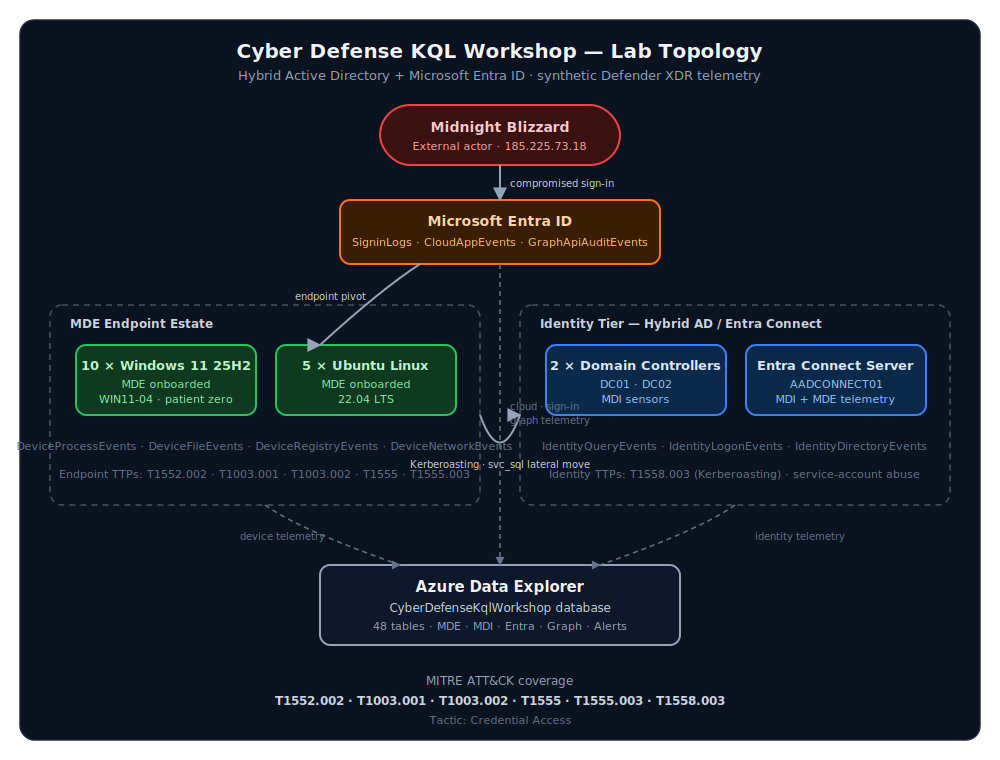

# Cyber Defense KQL Workshop for Azure Data Explorer (ADX)

## Description

This repository contains a complete two-hour cyber defense workshop package for teaching KQL-driven investigation in Azure Data Explorer (ADX). The workshop uses synthetic Microsoft security telemetry loaded into an ADX database so students can investigate a realistic hybrid identity and endpoint intrusion without needing live production infrastructure.

The lab is designed for **20 students** using the **ADX Web UI** with username/password sign-in and TAP or SMS MFA. Students query Microsoft Defender XDR-style, Microsoft Defender for Endpoint (MDE), Microsoft Defender for Identity (MDI), Microsoft Entra ID, Microsoft Graph, sign-in, cloud app, and alert telemetry.

## Purpose

The purpose of this workshop is to help defenders learn how to:

1. Use KQL to orient across ADX tables that mirror Microsoft security data sources.
2. Correlate endpoint, identity, cloud, Graph, sign-in, and alert evidence.
3. Build an investigation timeline from multiple telemetry sources.
4. Map observed attack behavior to MITRE ATT&CK techniques.
5. Understand which Microsoft telemetry tables illuminate specific credential-access behaviors.

## Scenario summary

The scenario uses a **FIN7-inspired hybrid identity credential-access intrusion** against a notional hybrid AD/Entra environment using `usag-cyber.local` and account domain `USAG-CYBER`. The intrusion begins with a risky Entra sign-in, suspicious OAuth consent, and Microsoft Graph activity, then pivots to a compromised Windows endpoint where the attacker performs credential-access activity. The attack path later touches domain controller telemetry and service-account activity against the Entra Connect server.

The diagram below traces the kill chain across the cloud, endpoint, and identity tiers. Each credential-access node is annotated with its MITRE ATT&CK technique, and the dotted edges show where each phase deposits telemetry into Azure Data Explorer for student investigation.



Notional infrastructure:

- 2 x domain controllers (server 2022) with MDI
- 10 x Windows 11 25H2 endpoints with MDE
- 5 x Ubuntu Linux endpoints with MDE
- 1 x Entra Connect server with MDI/MDE-relevant identity telemetry
- Hybrid Active Directory and Microsoft Entra ID environment (6K users / 4K service accounts)

The screenshot attack vectors are covered and mapped to MITRE ATT&CK, including `T1552.002`, `T1003.002`, `T1555.003`, `T1558.003`, `T1003.001`, and `T1555`.

## Artifact index

| Area | Purpose | Primary files |
| --- | --- | --- |
| ADX setup | Creates the ADX database tables, JSON ingestion mappings, generated telemetry, and ingestion flow | [`scripts\Initialize-Workshop.ps1`](scripts/Initialize-Workshop.ps1), [`scripts\Initialize-AdxTables.ps1`](scripts/Initialize-AdxTables.ps1), [`scripts\Import-SyntheticTelemetry.ps1`](scripts/Import-SyntheticTelemetry.ps1), [`scripts\AdxWorkshop.Common.psm1`](scripts/AdxWorkshop.Common.psm1) |
| Schemas | Holds one Microsoft Learn-derived JSON schema file per ADX table | [`schemas\`](schemas/), [`metadata\tables.manifest.json`](metadata/tables.manifest.json), [`tools\Build-SchemasFromMicrosoftLearn.ps1`](tools/Build-SchemasFromMicrosoftLearn.ps1) |
| Synthetic data | Holds generated schema-aligned NDJSON telemetry files and high-volume normal telemetry generation | [`data\generated\`](data/generated/), [`data\scenario-summary.json`](data/scenario-summary.json), [`scripts\New-SyntheticTelemetry.ps1`](scripts/New-SyntheticTelemetry.ps1) |
| Telemetry samples | Exports local-only Log Analytics CSV samples used to tune synthetic telemetry shape and field realism | [`scripts\Export-LogAnalyticsSamples.ps1`](scripts/Export-LogAnalyticsSamples.ps1), `sample\*.csv` |
| Student access | Creates or stages student users, TAP values, group access, and ADX viewer permissions | [`scripts\New-WorkshopStudents.ps1`](scripts/New-WorkshopStudents.ps1), [`scripts\Grant-StudentAdxAccess.ps1`](scripts/Grant-StudentAdxAccess.ps1), [`docs\student_access.md`](docs/student_access.md) |
| Scenario and MITRE | Documents the threat actor framing, infrastructure, and attack-vector to ATT&CK mapping | [`metadata\mitre-attack-mapping.json`](metadata/mitre-attack-mapping.json), [`data\scenario-summary.json`](data/scenario-summary.json), [`docs\workshop_design.md`](docs/workshop_design.md) |
| Workshop content | Provides the student lab, instructor guide, design notes, and diagrams | [`workshop\student_lab.kql`](workshop/student_lab.kql), [`docs\instructor_guide.md`](docs/instructor_guide.md), [`docs\workshop_design.md`](docs/workshop_design.md), [`docs\diagrams.md`](docs/diagrams.md) |
| Slides | Provides an instructor-led slide outline and a PowerPoint generator for Windows systems with PowerPoint installed | [`workshop\slide_deck_outline.md`](workshop/slide_deck_outline.md), [`scripts\New-WorkshopDeck.ps1`](scripts/New-WorkshopDeck.ps1) |
| Validation | Validates PowerShell syntax, schemas, and generated telemetry alignment | [`scripts\Test-WorkshopPackage.ps1`](scripts/Test-WorkshopPackage.ps1) |

## Quick start

Run these commands from the repository root.

### 1. Refresh table schemas from Microsoft Learn

The repository already includes generated schemas. Use this command only when you want to refresh them from Microsoft Learn.

```powershell
.\tools\Build-SchemasFromMicrosoftLearn.ps1 -Force
```

### 2. Create the ADX database, tables, mappings, synthetic telemetry, and ingest data

The default deployment target is the existing `dibsecadx` cluster in the `ADX` resource group:

- Cluster URI: `https://dibsecadx.eastus2.kusto.windows.net`
- Data ingestion URI: `https://ingest-dibsecadx.eastus2.kusto.windows.net`
- Subscription: `Security`
- Default database: `CyberDefenseKqlWorkshop`
- Retention: 1 year
- Hot cache: 1 year

```powershell
$securitySubscription = Get-AzSubscription -SubscriptionName 'Security'

.\scripts\Initialize-Workshop.ps1 `
  -SubscriptionId $securitySubscription.Id `
  -ResourceGroupName 'ADX' `
  -ClusterName 'dibsecadx' `
  -DatabaseName 'CyberDefenseKqlWorkshop'
```

If `CyberDefenseKqlWorkshop` already exists and `-OverwriteDatabase` is **not** supplied, the deploy script creates a new timestamped database, for example `CyberDefenseKqlWorkshop_20260430133500`, with the same one-year retention and hot-cache settings.

To intentionally replace the existing database and reuse the same database name:

```powershell
$securitySubscription = Get-AzSubscription -SubscriptionName 'Security'

.\scripts\Initialize-Workshop.ps1 `
  -SubscriptionId $securitySubscription.Id `
  -ResourceGroupName 'ADX' `
  -ClusterName 'dibsecadx' `
  -DatabaseName 'CyberDefenseKqlWorkshop' `
  -OverwriteDatabase
```

After the database exists, the deploy script creates or updates table schemas and ingestion mappings, validates that all expected tables exist, generates synthetic telemetry, and ingests the scenario data.

By default, deployment generates **5,000-10,000 final records per table** across a seven-day lookback ending at the time the script runs, including the malicious FIN7-inspired storyline so suspicious records blend into normal telemetry. Tune volume with:

```powershell
$securitySubscription = Get-AzSubscription -SubscriptionName 'Security'

.\scripts\Initialize-Workshop.ps1 `
  -SubscriptionId $securitySubscription.Id `
  -ResourceGroupName 'ADX' `
  -ClusterName 'dibsecadx' `
  -DatabaseName 'CyberDefenseKqlWorkshop' `
  -NormalMinRowsPerTable 5000 `
  -NormalMaxRowsPerTable 10000 `
  -SyntheticUserCount 6000 `
  -SyntheticServiceAccountCount 4000 `
  -NormalLookbackDays 7 `
  -RandomSeed 1702
```

To refresh local-only Log Analytics samples from the Security workspace for generator tuning:

```powershell
$securitySubscription = Get-AzSubscription -SubscriptionName 'Security'

.\scripts\Export-LogAnalyticsSamples.ps1 `
  -SubscriptionId $securitySubscription.Id `
  -WorkspaceName 'DIBSecCom' `
  -ResourceGroupName 'sentinel' `
  -LookbackDays 7 `
  -MaxRowsPerTable 5000
```

The `sample\*.csv` files are intentionally ignored by Git because they can contain real tenant telemetry.

### 3. Create or stage student identities

Create the CSV roster only:

```powershell
.\scripts\New-WorkshopStudents.ps1 `
  -TenantDomain '<tenant-domain>' `
  -InitialPassword '<temporary-password>'
```

Create cloud-only users, a student security group, and Temporary Access Pass values:

```powershell
.\scripts\New-WorkshopStudents.ps1 `
  -TenantDomain '<tenant-domain>' `
  -InitialPassword '<temporary-password>' `
  -CreateUsers `
  -CreateTemporaryAccessPass
```

Grant ADX database viewer access to the student group:

```powershell
.\scripts\Grant-StudentAdxAccess.ps1 `
  -ClusterUri 'https://<cluster>.<region>.kusto.windows.net' `
  -DatabaseName 'CyberDefenseKqlWorkshop' `
  -GroupObjectId '<student-group-object-id>'
```

### 4. Give students the ADX Web UI URL

```text
https://dataexplorer.azure.com/clusters/<cluster>.<region>.kusto.windows.net/databases/CyberDefenseKqlWorkshop
```

Students should sign in with their workshop username/password and complete MFA using TAP or SMS.

### 5. Validate the package

```powershell
.\scripts\Test-WorkshopPackage.ps1
```

## Workshop flow

The recommended two-hour flow is documented in [`docs\workshop_design.md`](docs/workshop_design.md). At a high level:

| Segment | Duration | Focus |
| --- | ---: | --- |
| Access check and KQL warm-up | 10 min | Confirm ADX Web UI access and table inventory |
| Scenario and infrastructure | 15 min | Explain hybrid topology, threat actor framing, and telemetry sources |
| Entra and Graph investigation | 20 min | Hunt risky sign-in, OAuth consent, and Graph activity |
| Endpoint credential access | 35 min | Hunt process, registry, file, and network telemetry |
| MDI and lateral movement | 20 min | Correlate SPN enumeration, Kerberos activity, and service-account use |
| Alert correlation and timeline | 15 min | Join `AlertInfo` and `AlertEvidence`; build the incident timeline |
| Debrief | 5 min | Discuss detections, controls, and operational takeaways |

## Key tables

The package creates 48 tables from Microsoft Learn-derived schema JSON. The most important investigation tables are:

- `SigninLogs`
- `EntraIdSignInEvents`
- `AADSignInEventsBeta`
- `CloudAppEvents`
- `GraphApiAuditEvents`
- `MicrosoftGraphActivityLogs`
- `DeviceInfo`
- `DeviceProcessEvents`
- `DeviceFileEvents`
- `DeviceRegistryEvents`
- `DeviceNetworkEvents`
- `DeviceLogonEvents`
- `IdentityInfo`
- `IdentityAccountInfo`
- `IdentityQueryEvents`
- `IdentityLogonEvents`
- `IdentityDirectoryEvents`
- `AlertInfo`
- `AlertEvidence`

## Schema note

`DeviceAlertEvents` is not created because Microsoft Learn documents `AlertInfo` and `AlertEvidence` as its Microsoft Defender XDR replacement. `DeviceInternetFacing` and `DeviceScriptEvents` did not expose stable public schema pages during generation, so the workshop represents related telemetry through `DeviceInfo`, `DeviceNetworkEvents`, and the alert tables.

## Prerequisites

To deploy and run the workshop, you need:

- ☁️ An existing ADX cluster
- 🔐 Azure permissions to create or manage an ADX database
- 🧭 ADX database admin permissions for table creation and ingestion
- 👥 Entra permissions for student user/group/TAP creation if using the identity helper script
- 🖥️ PowerShell 7 with the Azure, Kusto, and Microsoft Graph modules installed
- ⚙️ Azure CLI installed for fallback token acquisition and operational troubleshooting

### 🖥️ Terminal (CLI) install commands

Install PowerShell 7 silently / non-interactively from Windows Terminal, Command Prompt, or an existing PowerShell session:

```powershell
winget install --id Microsoft.PowerShell --source winget --silent --accept-package-agreements --accept-source-agreements
```

After PowerShell 7 installs, open a new **PowerShell 7** terminal and install the required modules:

```powershell
Install-Module -Name Az -Repository PSGallery -Scope CurrentUser -Force
Install-Module -Name Az.Kusto -Repository PSGallery -Scope CurrentUser -Force
Install-Module -Name Microsoft.Graph -Repository PSGallery -Scope CurrentUser -Force
```

Install Azure CLI silently / non-interactively:

```powershell
winget install --id Microsoft.AzureCLI --source winget --silent --accept-package-agreements --accept-source-agreements
```

Close and reopen the terminal after installing PowerShell 7 or Azure CLI.

### 🔗 Official install references

- PowerShell 7 on Windows: <https://learn.microsoft.com/powershell/scripting/install/installing-powershell-on-windows>
- Azure PowerShell Az module: <https://learn.microsoft.com/powershell/azure/install-azure-powershell>
- Az.Kusto module reference: <https://learn.microsoft.com/powershell/module/az.kusto/>
- Azure CLI on Windows: <https://learn.microsoft.com/cli/azure/install-azure-cli-windows>
- Microsoft Graph PowerShell SDK: <https://learn.microsoft.com/microsoftgraph/installation>

## Security and operations notes

- Use workshop-only identities; do not use real employee accounts for student access.
- Treat generated student roster CSV files as sensitive because they may contain initial passwords or TAP values.
- Treat `sample\*.csv` Log Analytics exports as sensitive local artifacts; they are used only to tune synthetic telemetry realism.
- Keep the scenario synthetic and isolated to ADX telemetry; no real attack execution is required.
- Delete or disable workshop users after the event.
- If reusing the ADX database for another class, rerun setup with `-ForceRecreateTables`.

## Main entry points

- Student lab: [`workshop\student_lab.kql`](workshop/student_lab.kql)
- Instructor guide: [`docs\instructor_guide.md`](docs/instructor_guide.md)
- Workshop design: [`docs\workshop_design.md`](docs/workshop_design.md)
- Diagrams: [`docs\diagrams.md`](docs/diagrams.md)
- Student access guide: [`docs\student_access.md`](docs/student_access.md)
- MITRE mapping: [`metadata\mitre-attack-mapping.json`](metadata/mitre-attack-mapping.json)
- Scenario summary: [`data\scenario-summary.json`](data/scenario-summary.json)

## Deployment duration estimate

For a fresh deployment to the existing `dibsecadx` cluster, plan for **25-40 minutes end-to-end** with the current defaults: 48 tables, 5K-10K rows per table, approximately 357K total rows, 6,000 synthetic users, and 4,000 synthetic service accounts.

| Step | Estimate |
| --- | ---: |
| Create ADX database with 1-year retention/hot cache | 2-5 min |
| Create/validate 48 tables + mappings | 2-5 min |
| Generate synthetic telemetry locally | 15-20 min |
| Ingest telemetry into ADX tables | 8-15 min |
| Final validation/checks | 1-3 min |

For a brand-new database, expected deployment time is closer to **25-35 minutes**. If overwriting/recreating a database or clearing existing data first, plan for **30-45 minutes**.

The 6,000 users and 4,000 service accounts are synthetic identities in the telemetry, not actual Entra users. Real student/user provisioning is separate and is not part of the default deployment path.

## KQL Resources

- [Bert-JanP](https://github.com/Bert-JanP)
- [Rod Trent](https://github.com/rod-trent)
- [Kusto Detective Agency](https://detective.kusto.io/)
- [KQL Query](https://kqlquery.com/)
- [Microsoft Learn: Kusto Query Language](https://learn.microsoft.com/en-us/kusto/query/?view=microsoft-fabric)
- [reprise99](https://github.com/reprise99)
