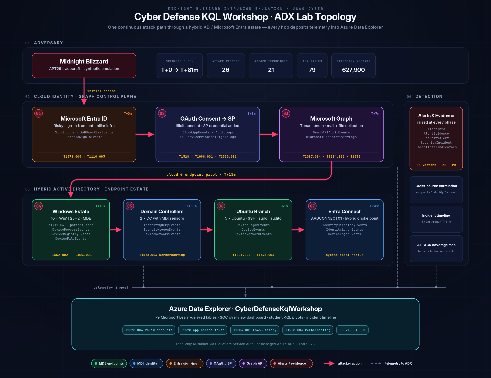
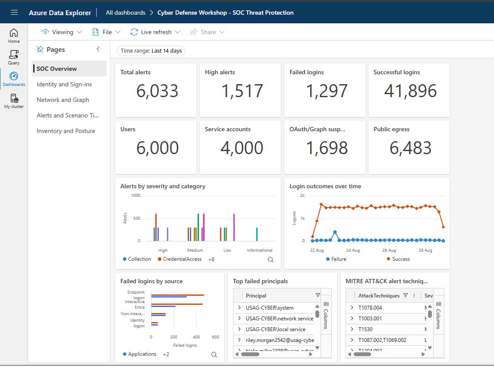
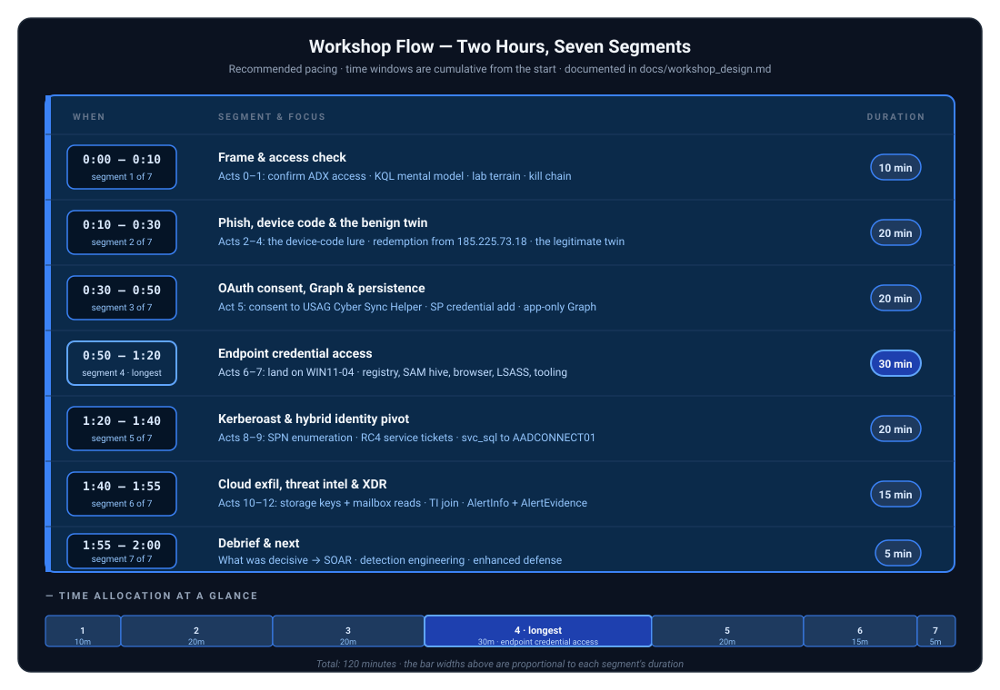
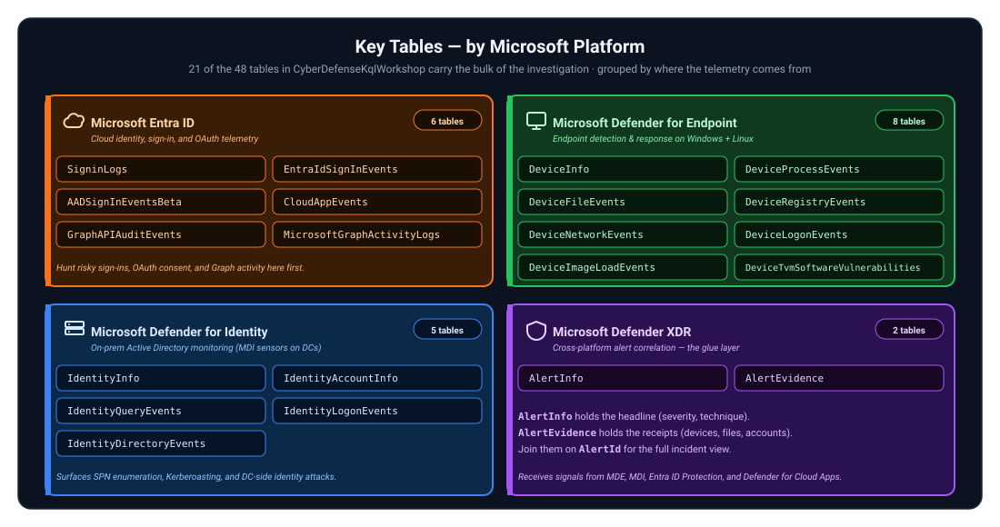

# 🚀 Cyber Defense KQL Workshop for Azure Data Explorer (ADX)

## 🐳 Docker-first conference delivery

For security conferences with walk-up or mixed-tenant participants, the **Docker, Cloudflare Service Auth, and read-only gateway** route is the primary delivery model. It keeps the workshop database on the instructor-controlled host, requires no participant tenant provisioning or per-student Cloudflare seat, opens no inbound host port, and exposes only read-only KQL through the temporary shared credential.

| Delivery model | Position | Best fit |
| --- | --- | --- |
| Docker Kustainer + Cloudflare Service Auth | **Primary** | Time-boxed security conferences, random participants, and fast classroom setup. |
| Managed Azure ADX + Microsoft Entra B2B | Secondary | Governed, recurring, or long-running programs that require per-person identities, MFA policy, and lifecycle governance. See [docs/managed_azure_adx_setup.md](docs/managed_azure_adx_setup.md). |

> [!IMPORTANT]
> The shared Service Token is a temporary lab password, not an identity system. Distribute it only for the event, restrict all public traffic through the read-only gateway, and rotate it immediately after class.

See [docs/cloudflare_adx_access.md](docs/cloudflare_adx_access.md) for the full host and student flow.

## 📖 Workshop description

This repository contains a complete two-hour cyber defense workshop package for teaching KQL-driven investigation in Azure Data Explorer (ADX). The workshop uses synthetic Microsoft security telemetry loaded into an ADX database so students can investigate a realistic hybrid identity and endpoint intrusion without needing live production infrastructure.

The lab is designed for **5 to 100 students** using the **ADX Web UI**. The primary conference path uses the local Kustainer snapshot through a Cloudflare TCP proxy; the managed Azure ADX and Microsoft Entra B2B path remains available when per-person tenant access is required. Students query Microsoft Defender XDR-style, Microsoft Defender for Endpoint (MDE), Microsoft Defender for Identity (MDI), Microsoft Entra ID, Microsoft Graph, sign-in, cloud app, and alert telemetry.

## 🎯 Purpose

The purpose of this workshop is to help defenders learn how to:

1. Use KQL to orient across ADX tables that mirror Microsoft security data sources.
2. Correlate endpoint, identity, cloud, Graph, sign-in, and alert evidence.
3. Build an investigation timeline from multiple telemetry sources.
4. Map observed attack behavior to MITRE ATT&CK techniques.
5. Understand how Microsoft Security Solutions (telemetry via tables) illuminate specific adversarial credential-access behaviors along the Cyber Kill Chain.

## 📋 Primary prerequisites

To run the Docker-first conference lab, you need:

- Docker Desktop or Docker Engine with Docker Compose v2 on the instructor host
- A Cloudflare account, a domain, and an API token for the tunnel, Service Auth policy, and optional DNS route
- Terraform on the instructor host
- PowerShell 7 and Azure CLI when refreshing the local snapshot from the source Student ADX database
- Student devices with Cloudflared and an account that can sign in to the ADX Web UI

## ☁️ Secondary delivery model: managed Azure ADX and Entra B2B

Need per-person identities, Conditional Access and MFA policy, and access-package lifecycle instead of a shared class credential? That route is documented end to end — prerequisites, tooling install commands, schema refresh, telemetry generation, database build, ADLS Gen2 backup, and B2B participant provisioning — in **[docs/managed_azure_adx_setup.md](docs/managed_azure_adx_setup.md)**.

## 🐻 Cyber Defense Scenario summary

The Cyber Defense scenario models a **Midnight Blizzard-inspired hybrid identity credential-access intrusion** against a notional organization named USAG Cyber. The intrusion begins with a risky Entra sign-in, suspicious OAuth consent, service-principal credential abuse, and Microsoft Graph activity — tradecraft that Midnight Blizzard (also tracked as APT29 / Cozy Bear / SVR-attributed) used in the real-world Microsoft and HPE breaches in 2023–2024. From there it pivots to a compromised Windows endpoint where the attacker performs credential-access activity, and the attack path later touches domain controller telemetry and service-account activity against the Entra Connect server.

The diagram below traces the kill chain across the cloud, endpoint, and identity tiers. Each phase deposits telemetry into Azure Data Explorer for student investigation.



For background on the threat actor that inspired this scenario — naming, attribution, recent activity, and the TTPs that map directly to the workshop's KQL queries — see [`docs/threat-actor-midnight-blizzard.md`](docs/threat-actor-midnight-blizzard.md).

Notional infrastructure:

- 2 domain controllers with MDI
- 10 Windows 11 25H2 endpoints with MDE
- 5 Ubuntu Linux endpoints with MDE
- 1 Entra Connect server with MDI/MDE-relevant identity telemetry
- Hybrid Active Directory and Microsoft Entra ID environment

The screenshot attack vectors are covered and mapped to MITRE ATT&CK, including `T1552.002`, `T1003.002`, `T1555.003`, `T1558.003`, `T1003.001`, and `T1555`.

## 🗂️ Artifact index

| Area | Purpose | Primary files |
| --- | --- | --- |
| Local conference runtime | Runs the persistent Kustainer snapshot, read-only gateway, and outbound Cloudflare connector for the primary attendee route | [compose.yaml](compose.yaml), [scripts/Copy-StudentAdxToLocalKusto.ps1](scripts/Copy-StudentAdxToLocalKusto.ps1), [scripts/Start-CloudflareAdxTunnel.ps1](scripts/Start-CloudflareAdxTunnel.ps1) |
| Local snapshot backup | Produces a self-contained archive of the local Kustainer state, the generated telemetry, and the schemas needed to restore it, refusing to ship a payload that does not cover the table manifest | [scripts/Backup-LocalKustoSnapshot.ps1](scripts/Backup-LocalKustoSnapshot.ps1) |
| Local snapshot restore | Rebuilds the database from an archive in a throwaway container and reconciles the restored row counts, so the backup is proven rather than assumed | [scripts/Restore-LocalKustoSnapshot.ps1](scripts/Restore-LocalKustoSnapshot.ps1) |
| Network boundary | Stops the Cloudflare connector routing around the read-only gateway to Kustainer's published port, and proves the boundary by sending packets rather than reading firewall rules | [scripts/Set-WorkshopNetworkIsolation.ps1](scripts/Set-WorkshopNetworkIsolation.ps1), [scripts/Test-WorkshopNetworkIsolation.ps1](scripts/Test-WorkshopNetworkIsolation.ps1) |
| Pre-class readiness | One go/no-go check over the six things that are quiet when they break, reapplying the firewall rule that a Docker restart drops | [scripts/Test-WorkshopReadiness.ps1](scripts/Test-WorkshopReadiness.ps1) |
| ADX setup | Creates the ADX database tables, JSON ingestion mappings, generated telemetry, and ingestion flow | [`scripts\Initialize-Workshop.ps1`](scripts/Initialize-Workshop.ps1), [`scripts\Initialize-AdxTables.ps1`](scripts/Initialize-AdxTables.ps1), [`scripts\Import-SyntheticTelemetry.ps1`](scripts/Import-SyntheticTelemetry.ps1), [`scripts\AdxWorkshop.Common.psm1`](scripts/AdxWorkshop.Common.psm1) |
| ADX backup | Creates secured ADLS Gen2 backup storage, exports schema records, exports table data as Parquet, and restores from the backup manifest | [`adx_db_backupNrestore\Initialize-AdxBackupStorage.ps1`](adx_db_backupNrestore/Initialize-AdxBackupStorage.ps1), [`adx_db_backupNrestore\Backup-AdxDatabase.ps1`](adx_db_backupNrestore/Backup-AdxDatabase.ps1), [`adx_db_backupNrestore\Restore-AdxDatabaseBackup.ps1`](adx_db_backupNrestore/Restore-AdxDatabaseBackup.ps1), [`adx_db_backupNrestore\adx_backup.md`](adx_db_backupNrestore/adx_backup.md) |
| Schemas | Holds one Microsoft Learn-derived JSON schema file per ADX table | [`schemas\`](schemas/), [`metadata\tables.manifest.json`](metadata/tables.manifest.json), [`tools\Build-SchemasFromMicrosoftLearn.ps1`](tools/Build-SchemasFromMicrosoftLearn.ps1), [`tools\Build-SchemaFromLiveTable.ps1`](tools/Build-SchemaFromLiveTable.ps1) |
| Tenant sampling | Exports real Log Analytics and Defender XDR advanced hunting rows plus per-column field profiles that ground synthetic generation | [`scripts\Export-TenantTelemetrySamples.ps1`](scripts/Export-TenantTelemetrySamples.ps1), [`scripts\Export-WorkshopTelemetryProfiles.ps1`](scripts/Export-WorkshopTelemetryProfiles.ps1) |
| Synthetic data | Reproduces the schema-aligned NDJSON telemetry, including all 19 unique-flag TTP chains and the seven-challenge scenario arc, from the committed schemas and field profiles. `data\generated\` is not tracked; run the parallel runner to create it | [`scripts\Invoke-WorkshopParallelGeneration.ps1`](scripts/Invoke-WorkshopParallelGeneration.ps1), [`scripts\New-SyntheticTelemetry.ps1`](scripts/New-SyntheticTelemetry.ps1), [`metadata\ttp-flag-matrix.json`](metadata/ttp-flag-matrix.json), [`metadata\field-profiles\`](metadata/field-profiles/), [`data\scenario-summary.json`](data/scenario-summary.json) |
| Data quality gates | Scores generated telemetry against the real field profiles, verifies tenant and subscription identifiers, and blocks tenant data from reaching the profiles | [`scripts\Test-SyntheticDataQuality.ps1`](scripts/Test-SyntheticDataQuality.ps1), [`scripts\Test-WorkshopIdentityInvariants.ps1`](scripts/Test-WorkshopIdentityInvariants.ps1), [`scripts\Test-FieldProfileSafety.ps1`](scripts/Test-FieldProfileSafety.ps1) |
| Tenant data safeguards | Enforces, on every commit and in CI, that raw tenant telemetry is never committed and that tracked field profiles carry no tenant data | [`.githooks\pre-commit`](.githooks/pre-commit), [`scripts\Install-WorkshopGitHooks.ps1`](scripts/Install-WorkshopGitHooks.ps1), [`.github\workflows\telemetry-safety.yml`](.github/workflows/telemetry-safety.yml) |
| Managed Azure access (secondary) | Documents the full managed Azure ADX build plus SFI-aligned B2B guest provisioning, MFA, access-package lifecycle, participant group access, ADX database viewer permissions, and dashboard sharing | [`docs\managed_azure_adx_setup.md`](docs/managed_azure_adx_setup.md), [`user_creation\README.md`](user_creation/README.md), [`docs\student_access.md`](docs/student_access.md), [`scripts\Grant-StudentAdxAccess.ps1`](scripts/Grant-StudentAdxAccess.ps1) |
| Cloudflare ADX class access | Documents the shared Service Auth credential, student TCP proxy, read-only KQL gateway, rotation, and troubleshooting | [`docs\cloudflare_adx_access.md`](docs/cloudflare_adx_access.md) |
| Kustainer gateway | Documents the read-only request policy, browser CORS/private-network support, default-database cleaner, configuration, and security boundary | [`tools\kusto-readonly-gateway\README.md`](tools/kusto-readonly-gateway/README.md) |
| Live CISA KEV enrichment | Queries CISA's current Known Exploited Vulnerabilities JSON catalog from ADX without persisting a copy in the workshop database | [`docs\cisa-kev-json.kql`](docs/cisa-kev-json.kql) |
| Scenario and MITRE | Documents the threat actor framing, infrastructure, and attack-vector to ATT&CK mapping | [`docs\threat-actor-midnight-blizzard.md`](docs/threat-actor-midnight-blizzard.md), [`metadata\mitre-attack-mapping.json`](metadata/mitre-attack-mapping.json), [`data\scenario-summary.json`](data/scenario-summary.json), [`docs\workshop_design.md`](docs/workshop_design.md) |
| Workshop content | Provides the student setup guide, instructor guide, design notes, and diagrams | [`STUDENT-GUIDES\STUDENT-LAB-SETUP-GUIDE.md`](STUDENT-GUIDES/STUDENT-LAB-SETUP-GUIDE.md), [`docs\instructor_guide.md`](docs/instructor_guide.md), [`docs\workshop_design.md`](docs/workshop_design.md), [`docs\diagrams.md`](docs/diagrams.md) |
| Slides | Provides the instructor-led deck and a PowerPoint generator for Windows systems with PowerPoint installed | [`STUDENT-GUIDES\Cyber_Defense_KQL_Workshop_v2.pptx`](STUDENT-GUIDES/Cyber_Defense_KQL_Workshop_v2.pptx), [`scripts\New-WorkshopDeck.ps1`](scripts/New-WorkshopDeck.ps1) |
| Validation | Validates PowerShell syntax, schemas, and generated telemetry alignment | [`scripts\Test-WorkshopPackage.ps1`](scripts/Test-WorkshopPackage.ps1) |

## ⚡ Primary quick start: Docker, Cloudflare, and shared Service Auth

Run these commands from the repository root for the conference route.

### 1. Start Kustainer and build the local Student snapshot

Use `up --wait` only for an initial host setup or an intentional container replacement. Once the snapshot exists, use `docker compose stop kusto` and `docker compose start kusto` for its routine lifecycle.

```powershell
docker compose up --detach --wait kusto
.\scripts\Copy-StudentAdxToLocalKusto.ps1 -ForceRecreate
```

### 2. Publish the read-only class route

```powershell
.\scripts\Start-CloudflareAdxTunnel.ps1 -Apply
```

Distribute only the ignored `infra\cloudflare-adx\student-access.env` file and [scripts/Start-StudentAdxProxy.ps1](scripts/Start-StudentAdxProxy.ps1) through the temporary class channel. Students use `http://127.0.0.1:8080` in the ADX Web UI. The gateway permits queries and read-only `.show` metadata commands only.

### 3. Back up the local snapshot, and prove it restores

Stop Kusto before taking a point-in-time file backup, then copy the generated ZIP to your secure storage or Google Drive. It contains synthetic workshop telemetry and should remain outside source control.

```powershell
docker compose stop kusto
.\scripts\Backup-LocalKustoSnapshot.ps1
docker compose start kusto
```

The command writes a timestamped ZIP under `data\backups\local-kusto` and reports its SHA-256 hash.

An archive is only as good as its last successful restore, so rehearse the restore rather than trusting the ZIP:

```powershell
.\scripts\Restore-LocalKustoSnapshot.ps1
```

That rebuilds the database in a throwaway container on `127.0.0.1:8099`, reconciles the restored row count against the archive, and removes the container afterwards. It never touches the workshop cluster. Add `-KeepContainer` to leave the restored copy running for inspection.

Two properties of the archive are worth knowing before you rely on it:

- **The NDJSON payload is what restores, not the persisted state.** The emulator registers a persistent database inside the container rather than in the mounted state directory, so a fresh container cannot attach state that a different container wrote; the attempt fails with an internal service error. The persisted state in the archive is only useful for putting files back under the same container instance.
- **The archive is self-contained.** It carries the table schemas and manifest alongside the data, so a restore does not depend on a matching checkout being present.

The backup refuses to run if the payload does not cover every table in `metadata\tables.manifest.json`. Override with `-AllowIncompleteExport` only when you deliberately want a partial archive.

See [docs/cloudflare_adx_access.md](docs/cloudflare_adx_access.md) for the full participant and recovery procedure.

## 🖥️ Primary host operations: exact Student ADX copy

The Student database is the source of truth for the local workflow. The copy script reads its live schema and rows directly from ADX, writes an ignored local NDJSON snapshot, loads the same rows into the official Kusto emulator, and verifies every table's row count.

Start the local runtime with Docker Compose. The `data` mount provides the exported files to Kusto, and `data\local-kusto` holds the persistent Student database files. Kusto is bound only to `127.0.0.1:8080`:

```powershell
docker compose up --detach --wait kusto
docker compose ps
```

Then copy the current Student database. `-ForceRecreate` replaces the previous local database and its persistent files before importing the fresh source snapshot:

```powershell
.\scripts\Copy-StudentAdxToLocalKusto.ps1 -ForceRecreate
```

The script defaults to `usag-wiesbaden-cys26.northeurope.kusto.windows.net`, database `cyber-defend-usagwsbdn-cys26`, and local database `CyberDefendStudentSnapshot`. It writes the verification manifest beneath `data\local-export\`, which is intentionally ignored by Git because it contains the copied telemetry.

> [!WARNING]
> **Preserve the Kustainer container.** The mounted files and Kustainer's database registration work together. Use `docker compose stop kusto` and `docker compose start kusto` for routine shutdown and startup. Do not use `docker compose down`, `docker compose rm`, `docker compose up` after a Compose configuration change, or `--force-recreate` for `kusto` while retaining the local snapshot. If a Kusto container replacement is required, first run `Backup-LocalKustoSnapshot.ps1`, then rebuild the database after the replacement by one of two routes: rerun `Copy-StudentAdxToLocalKusto.ps1 -ForceRecreate` to re-copy from the Student cluster, or rebuild offline from the backup archive. Prefer the offline route on site, because the Azure route needs cluster access and an entitled sign-in, and those are unavailable exactly when a rebuild is most likely to be needed:

```powershell
.\scripts\Restore-LocalKustoSnapshot.ps1 -ExtractPayloadTo .\data\generated
.\scripts\Import-GeneratedDataToKustainer.ps1
```

`kusto-defaultdb-cleaner` runs continuously in Compose. Once `CyberDefendStudentSnapshot` exists, it drops `NetDefaultDB` and removes its residual directory under `data\local-kusto\dbs`. On a fresh emulator, it leaves the default database in place until the Student import has created the retained snapshot database.

### Build the telemetry locally without Azure

`data\generated\` is not tracked. The package is roughly 900 MB of NDJSON and is reproduced deterministically from the committed schemas, field profiles, and a fixed random seed, so the generator is the artifact rather than its output. Use this route when there is no ADX cluster to copy from, or to rebuild after changing a schema or a profile.

```powershell
.\scripts\Invoke-WorkshopParallelGeneration.ps1
.\scripts\Import-GeneratedDataToKustainer.ps1
```

The runner splits the 79 tables across worker processes: about 14 minutes against 46 for the single-threaded generator, with a progress bar and an ETA. Its defaults reproduce the committed dataset exactly, including `DeviceProcessEvents` at 32,000 rows. Eight workers is the measured optimum on an 8-core machine and is the default — more is not better, because every worker repeats the two-minute setup phase and 16 workers finish a full run slower than 8.

`New-SyntheticTelemetry.ps1` is the worker used by the wrapper. Do not invoke it directly to produce data, including single-table or temporary fixtures. Use `Invoke-WorkshopParallelGeneration.ps1 -TableName <Table>` so the end time and random seed are pinned once and subset output remains deterministic.

The generator writes one NDJSON file per manifest table into `data\generated\`. The importer creates each table from its schema, applies a JSON ingestion mapping, ingests from the read-only `/workshop-data` mount, and reconciles every table's row count against the file on disk.

Verify the result before teaching from it:

```powershell
.\scripts\Test-WorkshopPackage.ps1
.\scripts\Test-SyntheticDataQuality.ps1
.\scripts\Test-WorkshopIdentityInvariants.ps1
.\scripts\Test-WorkshopTtpFlags.ps1 -DataDirectory .\data\generated
```

`Test-SyntheticDataQuality.ps1` scores each generated table against the real field profile in `metadata\field-profiles\`, reporting columns that are emptier than production, columns populated where production leaves them empty, and values outside the observed vocabulary. Columns the workshop deliberately populates beyond production are declared in `metadata\profile-overrides.json`, which both the generator and the quality gate read.

To refresh the field profiles from live telemetry, sign in to the tenant and run:

```powershell
.\scripts\Export-WorkshopTelemetryProfiles.ps1
.\scripts\Test-FieldProfileSafety.ps1
```

### Keeping tenant data out of this repository

`metadata\field-profiles\` is tracked, because those profiles are what make the generated telemetry reproducible. That makes them the one path by which live tenant data could reach a public repository, so the safeguard is enforced rather than documented.

Run this once per clone:

```powershell
.\scripts\Install-WorkshopGitHooks.ps1
```

Git does not version `.git\hooks`, so the tracked hook in `.githooks\` is inert until that installer points `core.hooksPath` at it. From then on, every commit is blocked if it stages anything under `sample\`, which holds raw capture data, or if a staged field profile contains an embedded GUID, an Azure subscription, resource group or tenant path, an onmicrosoft domain, a user principal name, an address, or a credential.

Column-name filtering alone is not enough. `SourceAgentId` carries Azure resource IDs containing a live subscription GUID, and a scan found 70 such columns before this check existed, so the check inspects the values themselves.

A local hook can be skipped with `--no-verify` and does nothing until installed, so [`.github\workflows\telemetry-safety.yml`](.github/workflows/telemetry-safety.yml) runs the same scan on every push and pull request, and additionally fails if raw telemetry or the generated package is ever tracked. The hook makes the failure fast and local; the workflow makes it unavoidable.

### Publish read-only local Kusto through Cloudflare

The same [compose.yaml](compose.yaml) runs a private read-only Kusto gateway and the `cloudflared` connector. The connector has no host port; it reaches the gateway over the private Compose network at `tcp://kusto-readonly-gateway:8081`. The gateway forwards read-only requests to Kusto while Kusto remains locally bound to `127.0.0.1:8080`.

> [!IMPORTANT]
> The gateway is a `build:` service, not a pulled image. `docker compose up --detach` reuses the last image built on this host, so after pulling or editing anything under [tools/kusto-readonly-gateway](tools/kusto-readonly-gateway) you must rebuild it explicitly:

```powershell
docker compose up --detach --build kusto-readonly-gateway
```

The tracked `post-merge` hook does this automatically when a pull changes the gateway, provided [scripts/Install-WorkshopGitHooks.ps1](scripts/Install-WorkshopGitHooks.ps1) has been run in this clone. Set `CDW_SKIP_GATEWAY_REBUILD=1` to opt out.

Neither `docker compose ps` nor the container health check can tell a current policy build from a stale one — both report healthy either way, because the health check only proves the process answers on `/healthz`. Confirm the policy itself is live: `.show tables` must succeed and `.show queries` must return 403. Rebuilding the gateway alone does not disturb the `kusto` container or the persistent Student snapshot.

> [!IMPORTANT]
> The gateway is only a boundary if the connector cannot route around it. Kustainer publishes `8080`, and publishing a port makes Docker insert a firewall accept ahead of its own cross-bridge isolation that is **not** restricted by source network — so the connector can reach the engine by IP and skip the gateway entirely. Binding the host side to `127.0.0.1` constrains the host, not other containers. Close it and prove it:

```powershell
.\scripts\Set-WorkshopNetworkIsolation.ps1
.\scripts\Test-WorkshopNetworkIsolation.ps1
```

`Start-CloudflareAdxTunnel.ps1 -Apply` does both automatically. The rule lives in the host firewall, so reapply it after a Docker engine restart or anything that recreates the networks. Details in [infra/cloudflare-adx/README.md](infra/cloudflare-adx/README.md).

Provision the shared class credential, read-only gateway route, and connector token once from the repository root:

```powershell
.\scripts\Start-CloudflareAdxTunnel.ps1 -Apply
```

For this repository's previous manually started containers, use the explicit one-time migration instead. It preserves the bind-mounted recovery files, then requires a fresh Student snapshot import because the Kustainer container is replaced:

```powershell
.\scripts\Start-CloudflareAdxTunnel.ps1 -Apply -MigrateLegacyContainers
.\scripts\Copy-StudentAdxToLocalKusto.ps1 -ForceRecreate
```

The launcher writes the connector token to the ignored `infra\cloudflare-adx\cloudflared.env` file and the shared student credential to the ignored `infra\cloudflare-adx\student-access.env` file. The student credential is a Cloudflare Service Token Client ID and Client Secret pair. It defaults to 720 hours (30 days), Terraform rejects a duration below 48 hours, consumes no per-student Cloudflare seats, and must be treated like a shared lab password.

After provisioning, use this normal runtime lifecycle:

```powershell
docker compose stop
docker compose start
docker compose logs --follow cloudflared
```

Kustainer can use the full two-minute graceful-stop period before it exits. Docker Desktop restarts the running services automatically through `restart: unless-stopped`.

For each student, distribute the ignored `student-access.env` file and [scripts/Start-StudentAdxProxy.ps1](scripts/Start-StudentAdxProxy.ps1) through your temporary class channel. The student starts a local proxy with:

```powershell
.\Start-StudentAdxProxy.ps1 -CredentialFile .\student-access.env
```

They then sign in to the Azure Data Explorer web UI with Microsoft Entra ID and add `http://127.0.0.1:8080` as the cluster connection URI. Cloudflare Service Auth is already handled by the local proxy, so the local Kustainer connection needs no further authentication. Users do not need a Cloudflare account, One-Time PIN, or individual Cloudflare Access seat.

The gateway permits queries and read-only `.show` metadata commands only. It rejects all other management commands, including `.drop`, `.add`, `.create`, `.alter`, `.delete`, `.ingest`, and `.set`.

The gateway also permits the Azure Data Explorer web UI browser origin, its `x-ms-*` request headers, and browser private-network preflight traffic to the student proxy. If a browser previously showed a connection failure, restart the student proxy, hard-refresh the ADX web UI with `Ctrl+F5`, and add the connection URI again.

Rotate the class credential after the workshop to invalidate the distributed pair and write a new unshared local pair:

```powershell
.\scripts\Start-CloudflareAdxTunnel.ps1 -Apply -RotateStudentCredential
```

See [infra/cloudflare-adx/README.md](infra/cloudflare-adx/README.md) for the Service Auth setup, DNS routing, secret handling, and connection validation steps.

## TTP cyber-range challenges

The cloud-adversary section of the source training deck is preserved as a [MarkItDown extract](docs/ttp-slide-extract.md) and researched in the [TTP cyber-range catalog](docs/ttp-cyber-range.md). All 19 challenges span email, identity, and application tradecraft; exactly seven form the canonical scenario. Each starts with flag-free evidence and requires one or two cross-table pivots before a globally unique themed flag appears once in its declared final telemetry field.

Trainees use [the sequential TTP hunt query pack](docs/ttp-hunt-queries.kql). Instructors use [the answer key](docs/instructor_answer_key.kql) and validate research metadata, seven-scenario membership, unique flag placement, generated data, and all live Kusto join paths with `scripts\Test-WorkshopTtpFlags.ps1`.

## Live CISA KEV enrichment

The read-only gateway permits ADX's `externaldata` operator, so analysts can query CISA's live Known Exploited Vulnerabilities (KEV) catalog without importing or persisting a copy in the workshop database. [docs/cisa-kev-json.kql](docs/cisa-kev-json.kql) reads CISA's official JSON feed, expands the `vulnerabilities` array, and returns the same columns as the CSV catalog.

## 📊 Import the ADX SOC threat protection dashboard

The repository includes an Azure Data Explorer dashboard template with a SOC-style landing page plus drilldown pages for identity/sign-ins, network/Graph activity, alert timeline review, and inventory/posture:

```powershell
.\scripts\New-WorkshopDashboard.ps1 `
  -ClusterUri 'https://<cluster>.<region>.kusto.windows.net' `
  -DatabaseName 'CyberDefenseKqlWorkshop'
```

In the ADX Web UI, go to **Dashboards** > **New dashboard** > **Import dashboard from file**, and select:

```text
dashboards\dashboard-CYBER-DEFEND-V4.json
```

The instructor imports this dashboard and presents it; students orient to it rather than importing it themselves, and the walkthrough in [`STUDENT-GUIDES\STUDENT-LAB-SETUP-GUIDE.md`](STUDENT-GUIDES/STUDENT-LAB-SETUP-GUIDE.md) explains what each page shows. Its screenshots match this file. If you already imported an older copy, open that dashboard and use **File** > **Replace dashboard with file** to update it in place.

If dashboard import is unavailable, use `dashboards\cyber-defense-workshop-dashboard.kql` to run and pin the same KQL tiles manually. The older `dashboards\cyber-defense-workshop-dashboard.json` export is kept for reference only and is superseded by the V4 file above.

On the managed Azure route, share the dashboard with the participant security group using dashboard `Can view` permission, then distribute the link. Dashboard access still requires underlying ADX database viewer access. See [docs/managed_azure_adx_setup.md](docs/managed_azure_adx_setup.md).

After import, the **SOC Overview** page should provide a threat-protection landing view with alert, sign-in, identity, Graph, egress, MITRE, and scenario timeline tiles:



## ✅ Validate the package

```powershell
.\scripts\Test-WorkshopPackage.ps1
```

## 🧭 Workshop flow

The recommended two-hour flow is documented in [`docs\workshop_design.md`](docs/workshop_design.md). At a high level:



## 🗄️ Key tables

The package creates 79 tables (JSON) from Microsoft Security & Operational Services. The 32 tables below carry the bulk of the investigation work, grouped by the Microsoft Security Defender XDR platform that produces them:



## 🧯 Instructor troubleshooting

| Symptom | Cause and fix |
| --- | --- |
| Students report `connection refused` on `127.0.0.1:8080` | Their local `cloudflared` proxy is not running. Have them re-run the step 2 command from the student guide and leave that terminal open. |
| Local snapshot disappeared after a Compose change | The Kustainer container was replaced, which drops the database registration. Rerun `Copy-StudentAdxToLocalKusto.ps1 -ForceRecreate`. |
| Row counts far below ~624,000 | The local database is a stale snapshot. Recopy from the source cluster, or rebuild with `Invoke-WorkshopParallelGeneration.ps1` followed by `Import-GeneratedDataToKustainer.ps1`. |
| `data\generated\` is empty after cloning | That directory is intentionally untracked. Run `.\scripts\Invoke-WorkshopParallelGeneration.ps1` to reproduce it from the committed schemas and field profiles. |
| Dashboard tiles blank for everyone | Data source still points at the cloud cluster. Set it to `http://127.0.0.1:8080` and database `CyberDefendStudentSnapshot`. |
| One tile empty, everything else fine | Not a connection problem. Adjust the global time range and check that specific query. |
| Browser rejects the local connection | Complete the ADX **Trust** prompts and the browser **Allow** prompt, then hard-refresh with `Ctrl+F5`. |
| Student credential leaked or class ended | Rotate immediately: `.\scripts\Start-CloudflareAdxTunnel.ps1 -Apply -RotateStudentCredential`. |
| `git push` reports an error but the push worked | PowerShell surfaces git's stderr progress as `NativeCommandError`. Verify with `git rev-list --count origin/main..HEAD`. |

## 🛡️ Security and operations notes

- For external conference participants, use the primary Docker and Cloudflare Service Auth route with its temporary shared credential, read-only gateway, and post-class credential rotation. Use B2B guest access only for the secondary managed Azure ADX model documented in [docs/managed_azure_adx_setup.md](docs/managed_azure_adx_setup.md).
- Treat generated student roster CSV files as sensitive if using the internal-only identity helper scripts because they may contain initial passwords or TAP values.
- Treat ADX backup manifests and local `schema.csl` files as sensitive operational artifacts. Local backups are written under `data\backups\`, which is git-ignored.
- ADX backups use ADLS Gen2, a user-assigned managed identity, RBAC, disabled shared-key access, and disabled anonymous blob access. Prefer the default managed-private-endpoint mode for nonpublic storage.
- Keep the scenario synthetic and isolated to ADX telemetry; no real attack execution is required.
- `AADUserRiskEvents` generates 5,500 synthetic global Identity Protection risk detections, including scenario-aligned high-risk rows for Victor Alvarez's compromised sign-in.
- Expire or remove participant access package assignments after the event and confirm the participant security group is empty.
- If reusing the ADX database for another class, rerun setup with `-ForceRecreateTables`.

## 🚪 Main entry points

- Student setup guide: [`STUDENT-GUIDES\STUDENT-LAB-SETUP-GUIDE.md`](STUDENT-GUIDES/STUDENT-LAB-SETUP-GUIDE.md)
- Instructor guide: [`docs\instructor_guide.md`](docs/instructor_guide.md)
- Workshop design: [`docs\workshop_design.md`](docs/workshop_design.md)
- Diagrams: [`docs\diagrams.md`](docs/diagrams.md)
- ADX backup guide: [`adx_db_backupNrestore\adx_backup.md`](adx_db_backupNrestore/adx_backup.md)
- Threat actor profile: [`docs\threat-actor-midnight-blizzard.md`](docs/threat-actor-midnight-blizzard.md)
- Managed Azure ADX + Entra B2B setup (secondary): [`docs\managed_azure_adx_setup.md`](docs/managed_azure_adx_setup.md)
- B2B user provisioning guide: [`user_creation\README.md`](user_creation/README.md)
- Student access guide: [`docs\student_access.md`](docs/student_access.md)
- MITRE mapping: [`metadata\mitre-attack-mapping.json`](metadata/mitre-attack-mapping.json)
- Scenario summary: [`data\scenario-summary.json`](data/scenario-summary.json)

## 📚 References

- [Kusto Query Language reference](https://learn.microsoft.com/kusto/query/)
- [Azure Data Explorer documentation](https://learn.microsoft.com/azure/data-explorer/)
- [Kustainer, the ADX emulator for containers](https://learn.microsoft.com/azure/data-explorer/kusto-emulator-overview)
- [Microsoft Defender XDR advanced hunting schema](https://learn.microsoft.com/defender-xdr/advanced-hunting-schema-tables)
- [Cloudflare Zero Trust service tokens](https://developers.cloudflare.com/cloudflare-one/identity/service-tokens/)
- [MITRE ATT&CK: APT29 (G0016)](https://attack.mitre.org/groups/G0016/)

---

Cyber Defense KQL Workshop for Azure Data Explorer · synthetic telemetry only, no production data · 79 tables · ~624K rows
