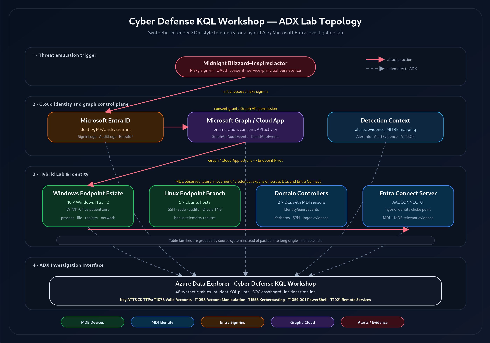
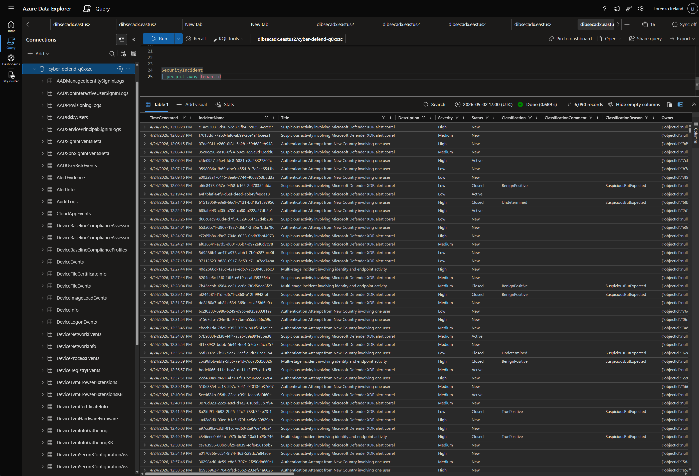

# 🚀 Cyber Defense KQL Workshop for Azure Data Explorer (ADX)

## Description

This repository contains a complete two-hour cyber defense workshop package for teaching KQL-driven investigation in Azure Data Explorer (ADX). The workshop uses synthetic Microsoft security telemetry loaded into an ADX database so students can investigate a realistic hybrid identity and endpoint intrusion without needing live production infrastructure.

The lab is designed for **20 students** using the **ADX Web UI**. For conference delivery, students should be provisioned as Microsoft Entra B2B guests through an access package, protected with MFA, and authorized through a participant security group. Students query Microsoft Defender XDR-style, Microsoft Defender for Endpoint (MDE), Microsoft Defender for Identity (MDI), Microsoft Entra ID, Microsoft Graph, sign-in, cloud app, and alert telemetry.

## Purpose

The purpose of this workshop is to help defenders learn how to:

1. Use KQL to orient across ADX tables that mirror Microsoft security data sources.
2. Correlate endpoint, identity, cloud, Graph, sign-in, and alert evidence.
3. Build an investigation timeline from multiple telemetry sources.
4. Map observed attack behavior to MITRE ATT&CK techniques.
5. Understand which Microsoft telemetry tables illuminate specific credential-access behaviors.

## Prerequisites

To deploy and run the workshop, you need:

- ☁️ An existing ADX cluster
- 🔐 Azure permissions to create or manage an ADX database
- 🧭 ADX database admin permissions for table creation and ingestion
- 👥 Entra permissions for B2B guest onboarding, access packages, security groups, and Conditional Access
- 🖥️ PowerShell 7 with the Azure, Kusto, and Microsoft Graph modules installed
- ⚙️ Azure CLI installed for fallback token acquisition and operational troubleshooting

### 🖥️ Terminal (CLI) install commands

Install PowerShell 7 silently / non-interactively from Windows Terminal, Command Prompt, or an existing PowerShell session:

```powershell
winget install --id Microsoft.PowerShell --source winget --silent --accept-package-agreements --accept-source-agreements
```

After PowerShell 7 installs, open a new **PowerShell 7** terminal and install the required modules:

```powershell
Install-Module -Name Az -Repository PSGallery -Scope CurrentUser -Force
Install-Module -Name Az.Kusto -Repository PSGallery -Scope CurrentUser -Force
Install-Module -Name Microsoft.Graph -Repository PSGallery -Scope CurrentUser -Force
```

Install Azure CLI silently / non-interactively:

```powershell
winget install --id Microsoft.AzureCLI --source winget --silent --accept-package-agreements --accept-source-agreements
```

Close and reopen the terminal after installing PowerShell 7 or Azure CLI.

### 🔗 Official install references

- PowerShell 7 on Windows: <https://learn.microsoft.com/powershell/scripting/install/installing-powershell-on-windows>
- Azure PowerShell Az module: <https://learn.microsoft.com/powershell/azure/install-azure-powershell>
- Az.Kusto module reference: <https://learn.microsoft.com/powershell/module/az.kusto/>
- Azure CLI on Windows: <https://learn.microsoft.com/cli/azure/install-azure-cli-windows>
- Microsoft Graph PowerShell SDK: <https://learn.microsoft.com/microsoftgraph/installation>

## Cyber Defense Scenario summary

The Cyber Defense scenario models a **Midnight Blizzard-inspired hybrid identity credential-access intrusion** against a notional organization named USAG Cyber. The intrusion begins with a risky Entra sign-in, suspicious OAuth consent, service-principal credential abuse, and Microsoft Graph activity — tradecraft that Midnight Blizzard (also tracked as APT29 / Cozy Bear / SVR-attributed) used in the real-world Microsoft and HPE breaches in 2023–2024. From there it pivots to a compromised Windows endpoint where the attacker performs credential-access activity, and the attack path later touches domain controller telemetry and service-account activity against the Entra Connect server.

The diagram below traces the kill chain across the cloud, endpoint, and identity tiers. Each phase deposits telemetry into Azure Data Explorer for student investigation.



For background on the threat actor that inspired this scenario — naming, attribution, recent activity, and the TTPs that map directly to the workshop's KQL queries — see [`docs/threat-actor-midnight-blizzard.md`](docs/threat-actor-midnight-blizzard.md).

Notional infrastructure:

- 2 domain controllers with MDI
- 10 Windows 11 25H2 endpoints with MDE
- 5 Ubuntu Linux endpoints with MDE
- 1 Entra Connect server with MDI/MDE-relevant identity telemetry
- Hybrid Active Directory and Microsoft Entra ID environment

The screenshot attack vectors are covered and mapped to MITRE ATT&CK, including `T1552.002`, `T1003.002`, `T1555.003`, `T1558.003`, `T1003.001`, and `T1555`.

## Artifact index

| Area | Purpose | Primary files |
| --- | --- | --- |
| ADX setup | Creates the ADX database tables, JSON ingestion mappings, generated telemetry, and ingestion flow | [`scripts\Initialize-Workshop.ps1`](scripts/Initialize-Workshop.ps1), [`scripts\Initialize-AdxTables.ps1`](scripts/Initialize-AdxTables.ps1), [`scripts\Import-SyntheticTelemetry.ps1`](scripts/Import-SyntheticTelemetry.ps1), [`scripts\AdxWorkshop.Common.psm1`](scripts/AdxWorkshop.Common.psm1) |
| ADX backup | Creates secured ADLS Gen2 backup storage, exports schema records, exports table data as Parquet, and restores from the backup manifest | [`adx_db_backupNrestore\Initialize-AdxBackupStorage.ps1`](adx_db_backupNrestore/Initialize-AdxBackupStorage.ps1), [`adx_db_backupNrestore\Backup-AdxDatabase.ps1`](adx_db_backupNrestore/Backup-AdxDatabase.ps1), [`adx_db_backupNrestore\Restore-AdxDatabaseBackup.ps1`](adx_db_backupNrestore/Restore-AdxDatabaseBackup.ps1), [`adx_db_backupNrestore\adx_backup.md`](adx_db_backupNrestore/adx_backup.md) |
| Schemas | Holds one Microsoft Learn-derived JSON schema file per ADX table | [`schemas\`](schemas/), [`metadata\tables.manifest.json`](metadata/tables.manifest.json), [`tools\Build-SchemasFromMicrosoftLearn.ps1`](tools/Build-SchemasFromMicrosoftLearn.ps1) |
| Synthetic data | Holds generated schema-aligned NDJSON telemetry files | [`data\generated\`](data/generated/), [`data\scenario-summary.json`](data/scenario-summary.json), [`scripts\New-SyntheticTelemetry.ps1`](scripts/New-SyntheticTelemetry.ps1) |
| Participant access | Documents SFI-aligned B2B guest provisioning, MFA, access-package lifecycle, participant group access, ADX database viewer permissions, and dashboard sharing | [`user_creation\README.md`](user_creation/README.md), [`docs\student_access.md`](docs/student_access.md), [`scripts\Grant-StudentAdxAccess.ps1`](scripts/Grant-StudentAdxAccess.ps1) |
| Cloudflare ADX class access | Documents the shared Service Auth credential, student TCP proxy, read-only KQL gateway, rotation, and troubleshooting | [`docs\cloudflare_adx_access.md`](docs/cloudflare_adx_access.md) |
| Kustainer gateway | Documents the read-only request policy, browser CORS/private-network support, default-database cleaner, configuration, and security boundary | [`tools\kusto-readonly-gateway\README.md`](tools/kusto-readonly-gateway/README.md) |
| Scenario and MITRE | Documents the threat actor framing, infrastructure, and attack-vector to ATT&CK mapping | [`docs\threat-actor-midnight-blizzard.md`](docs/threat-actor-midnight-blizzard.md), [`metadata\mitre-attack-mapping.json`](metadata/mitre-attack-mapping.json), [`data\scenario-summary.json`](data/scenario-summary.json), [`docs\workshop_design.md`](docs/workshop_design.md) |
| Workshop content | Provides the student lab, instructor guide, design notes, and diagrams | [`workshop\student_lab.kql`](workshop/student_lab.kql), [`docs\instructor_guide.md`](docs/instructor_guide.md), [`docs\workshop_design.md`](docs/workshop_design.md), [`docs\diagrams.md`](docs/diagrams.md) |
| Slides | Provides an instructor-led slide outline and a PowerPoint generator for Windows systems with PowerPoint installed | [`workshop\slide_deck_outline.md`](workshop/slide_deck_outline.md), [`scripts\New-WorkshopDeck.ps1`](scripts/New-WorkshopDeck.ps1) |
| Validation | Validates PowerShell syntax, schemas, and generated telemetry alignment | [`scripts\Test-WorkshopPackage.ps1`](scripts/Test-WorkshopPackage.ps1) |

## Quick start

Run these commands from the repository root.

### 1. Refresh table schemas from Microsoft Learn

The repository already includes generated schemas. Use this command only when you want to refresh them from Microsoft Learn.

```powershell
.\tools\Build-SchemasFromMicrosoftLearn.ps1 -Force
```

### 2. Create the ADX database, tables, mappings, synthetic telemetry, and ingest data

```powershell
.\scripts\Initialize-Workshop.ps1 `
  -ResourceGroupName '<resource-group>' `
  -ClusterName '<adx-cluster-name>' `
  -DatabaseName 'CyberDefenseKqlWorkshop' `
  -ForceRecreateTables
```

If the database already exists and you only need to create tables and load data:

```powershell
.\scripts\Initialize-Workshop.ps1 `
  -ResourceGroupName '<resource-group>' `
  -ClusterName '<adx-cluster-name>' `
  -ClusterUri 'https://<cluster>.<region>.kusto.windows.net' `
  -DatabaseName 'CyberDefenseKqlWorkshop' `
  -SkipDatabaseCreate `
  -ForceRecreateTables
```

### Optional: back up the ADX database to secured ADLS Gen2

The backup flow uses a user-assigned managed identity, RBAC, no shared keys, and no anonymous blob access. The default storage mode disables public network access and creates ADX managed private endpoints to the storage account.

```powershell
.\adx_db_backupNrestore\Initialize-AdxBackupStorage.ps1 `
  -SubscriptionName 'Security' `
  -ResourceGroupName 'ADX' `
  -ClusterName 'dibsecadx' `
  -ClusterUri 'https://dibsecadx.eastus2.kusto.windows.net' `
  -DatabaseName 'cyber-defend-q0xxzc'
```

Use the `backupCommand` from that script's JSON output, or run the backup directly:

```powershell
.\adx_db_backupNrestore\Backup-AdxDatabase.ps1 `
  -ClusterUri 'https://dibsecadx.eastus2.kusto.windows.net' `
  -DatabaseName 'cyber-defend-q0xxzc' `
  -StorageAccountName '<storage-account-name>' `
  -FileSystemName 'adx-backups' `
  -ManagedIdentityObjectId '<uami-object-id>'
```

Restore later from the generated local manifest and schema file:

```powershell
.\adx_db_backupNrestore\Restore-AdxDatabaseBackup.ps1 `
  -ClusterUri 'https://dibsecadx.eastus2.kusto.windows.net' `
  -DatabaseName '<restore-database-name>' `
  -ManifestPath '.\data\backups\<backup-name>\backup-manifest.json'
```

For operational details and the security model, see [`adx_db_backupNrestore\adx_backup.md`](adx_db_backupNrestore/adx_backup.md).

### Run an exact Student ADX copy locally

The Student database is the source of truth for the local workflow. The copy script reads its live schema and rows directly from ADX, writes an ignored local NDJSON snapshot, loads the same rows into the official Kusto emulator, and verifies every table's row count.

Start the local runtime with Docker Compose. The `data` mount provides the exported files to Kusto, and `data\local-kusto` holds the persistent Student database files. Kusto is bound only to `127.0.0.1:8080`:

```powershell
docker compose up --detach --wait kusto
docker compose ps
```

Then copy the current Student database. `-ForceRecreate` replaces the previous local database and its persistent files before importing the fresh source snapshot:

```powershell
.\scripts\Copy-StudentAdxToLocalKusto.ps1 -ForceRecreate
```

The script defaults to `usag-wiesbaden-cys26.northeurope.kusto.windows.net`, database `cyber-defend-usagwsbdn-cys26`, and local database `CyberDefendStudentSnapshot`. It writes the verification manifest beneath `data\local-export\`, which is intentionally ignored by Git because it contains the copied telemetry.

> ⚠️ **Preserve the Kustainer container.** The mounted files and Kustainer's database registration work together. Use `docker compose stop kusto` and `docker compose start kusto` for routine shutdown and startup. Do not use `docker compose down`, `docker compose rm`, or `--force-recreate` for `kusto` while retaining the local snapshot. If a Kusto container replacement is required, rerun `Copy-StudentAdxToLocalKusto.ps1 -ForceRecreate` after the replacement to rebuild and verify the mounted Student database.

`kusto-defaultdb-cleaner` runs continuously in Compose. Once `CyberDefendStudentSnapshot` exists, it drops `NetDefaultDB` and removes its residual directory under `data\local-kusto\dbs`. On a fresh emulator, it leaves the default database in place until the Student import has created the retained snapshot database.

### Publish read-only local Kusto through Cloudflare

The same [compose.yaml](compose.yaml) runs a private read-only Kusto gateway and the `cloudflared` connector. The connector has no host port; it reaches the gateway over the private Compose network at `tcp://kusto-readonly-gateway:8081`. The gateway forwards read-only requests to Kusto while Kusto remains locally bound to `127.0.0.1:8080`.

Provision the shared class credential, read-only gateway route, and connector token once from the repository root:

```powershell
.\scripts\Start-CloudflareAdxTunnel.ps1 -Apply
```

For this repository's previous manually started containers, use the explicit one-time migration instead. It preserves the bind-mounted recovery files, then requires a fresh Student snapshot import because the Kustainer container is replaced:

```powershell
.\scripts\Start-CloudflareAdxTunnel.ps1 -Apply -MigrateLegacyContainers
.\scripts\Copy-StudentAdxToLocalKusto.ps1 -ForceRecreate
```

The launcher writes the connector token to the ignored `infra\cloudflare-adx\cloudflared.env` file and the shared student credential to the ignored `infra\cloudflare-adx\student-access.env` file. The student credential is a Cloudflare Service Token Client ID and Client Secret pair. It defaults to 72 hours, Terraform rejects a duration below 48 hours, consumes no per-student Cloudflare seats, and must be treated like a shared lab password.

After provisioning, use this normal runtime lifecycle:

```powershell
docker compose stop
docker compose start
docker compose logs --follow cloudflared
```

Kustainer can use the full two-minute graceful-stop period before it exits. Docker Desktop restarts the running services automatically through `restart: unless-stopped`.

For each student, distribute the ignored `student-access.env` file and [scripts/Start-StudentAdxProxy.ps1](scripts/Start-StudentAdxProxy.ps1) through your temporary class channel. The student starts a local proxy with:

```powershell
.\Start-StudentAdxProxy.ps1 -CredentialFile .\student-access.env
```

They then sign in to the Azure Data Explorer web UI with Microsoft Entra ID and add `http://127.0.0.1:8080;Fed=false` as the cluster connection URI. `Fed=false` disables Microsoft Entra authentication for the local Kustainer connection; Cloudflare Service Auth is already handled by the local proxy. Users do not need a Cloudflare account, One-Time PIN, or individual Cloudflare Access seat.

The gateway permits queries and read-only `.show` metadata commands only. It rejects all other management commands, including `.drop`, `.add`, `.create`, `.alter`, `.delete`, `.ingest`, and `.set`.

The gateway also permits the Azure Data Explorer web UI browser origin, its `x-ms-*` request headers, and browser private-network preflight traffic to the student proxy. If a browser previously showed a connection failure, restart the student proxy, hard-refresh the ADX web UI with `Ctrl+F5`, and add the complete `;Fed=false` connection URI again.

Rotate the class credential after the workshop to invalidate the distributed pair and write a new unshared local pair:

```powershell
.\scripts\Start-CloudflareAdxTunnel.ps1 -Apply -RotateStudentCredential
```

See [infra/cloudflare-adx/README.md](infra/cloudflare-adx/README.md) for the Service Auth setup, DNS routing, secret handling, and connection validation steps.

### 3. Provision participant access

For SFI-aligned conference delivery, provision students as Microsoft Entra B2B guests through an entitlement management access package. The access package should add approved participants to a resource-tenant security group, enforce MFA through Conditional Access, and expire access after the event.

Grant ADX database viewer access to the participant security group:

```powershell
.\scripts\Grant-StudentAdxAccess.ps1 `
  -ClusterUri 'https://<cluster>.<region>.kusto.windows.net' `
  -DatabaseName 'CyberDefenseKqlWorkshop' `
  -GroupObjectId '<student-group-object-id>'
```

### 4. Give students the ADX Web UI URL

```text
https://dataexplorer.azure.com/clusters/<cluster>.<region>.kusto.windows.net/databases/CyberDefenseKqlWorkshop
```

Students sign in with their home organization identity, redeem the guest invitation when prompted, and complete MFA according to the resource tenant policy.

After login, students should see the ADX database, workshop tables, and query results in the web UI. The screenshot below shows the expected query experience using `SecurityIncident` telemetry:



### 5. Import the ADX SOC threat protection dashboard

The repository includes an Azure Data Explorer dashboard template with a SOC-style landing page plus drilldown pages for identity/sign-ins, network/Graph activity, alert timeline review, and inventory/posture:

```powershell
.\scripts\New-WorkshopDashboard.ps1 `
  -ClusterUri 'https://<cluster>.<region>.kusto.windows.net' `
  -DatabaseName 'CyberDefenseKqlWorkshop'
```

In the ADX Web UI, go to **Dashboards** > **New dashboard** > **Import dashboard from file**, and select:

```text
dashboards\cyber-defense-workshop-dashboard.json
```

If you already imported an older copy, open that dashboard and use **File** > **Replace dashboard with file** to update it in place.

If dashboard import is unavailable, use `dashboards\cyber-defense-workshop-dashboard.kql` to run and pin the same KQL tiles manually.

Share the dashboard with the participant security group using dashboard `Can view` permission, then distribute the dashboard link. Dashboard access still requires underlying ADX database viewer access.

After import, the **SOC Overview** page should provide a threat-protection landing view with alert, sign-in, identity, Graph, egress, MITRE, and scenario timeline tiles:


### 6. Validate the package

```powershell
.\scripts\Test-WorkshopPackage.ps1
```

## Workshop flow

The recommended two-hour flow is documented in [`docs\workshop_design.md`](docs/workshop_design.md). At a high level:


## Key tables

The package creates 47 tables from Microsoft Learn-derived schema JSON. The 21 tables below carry the bulk of the investigation work, grouped by the Microsoft platform that produces them:


## Security and operations notes

- Use B2B guest access for external conference participants; do not use shared accounts or unmanaged temporary passwords.
- Treat generated student roster CSV files as sensitive if using the internal-only identity helper scripts because they may contain initial passwords or TAP values.
- Treat ADX backup manifests and local `schema.csl` files as sensitive operational artifacts. Local backups are written under `data\backups\`, which is git-ignored.
- ADX backups use ADLS Gen2, a user-assigned managed identity, RBAC, disabled shared-key access, and disabled anonymous blob access. Prefer the default managed-private-endpoint mode for nonpublic storage.
- Keep the scenario synthetic and isolated to ADX telemetry; no real attack execution is required.
- `AADUserRiskEvents` generates 5,500 synthetic global Identity Protection risk detections, including scenario-aligned high-risk rows for Victor Alvarez's compromised sign-in.
- Expire or remove participant access package assignments after the event and confirm the participant security group is empty.
- If reusing the ADX database for another class, rerun setup with `-ForceRecreateTables`.

## Main entry points

- Student lab: [`workshop\student_lab.kql`](workshop/student_lab.kql)
- Instructor guide: [`docs\instructor_guide.md`](docs/instructor_guide.md)
- Workshop design: [`docs\workshop_design.md`](docs/workshop_design.md)
- Diagrams: [`docs\diagrams.md`](docs/diagrams.md)
- ADX backup guide: [`adx_db_backupNrestore\adx_backup.md`](adx_db_backupNrestore/adx_backup.md)
- Threat actor profile: [`docs\threat-actor-midnight-blizzard.md`](docs/threat-actor-midnight-blizzard.md)
- B2B user provisioning guide: [`user_creation\README.md`](user_creation/README.md)
- Student access guide: [`docs\student_access.md`](docs/student_access.md)
- MITRE mapping: [`metadata\mitre-attack-mapping.json`](metadata/mitre-attack-mapping.json)
- Scenario summary: [`data\scenario-summary.json`](data/scenario-summary.json)
