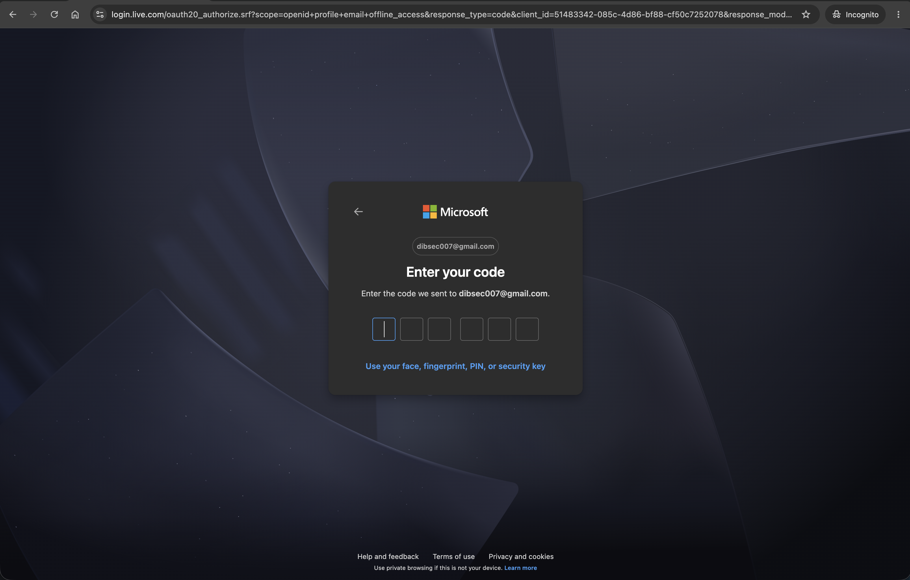
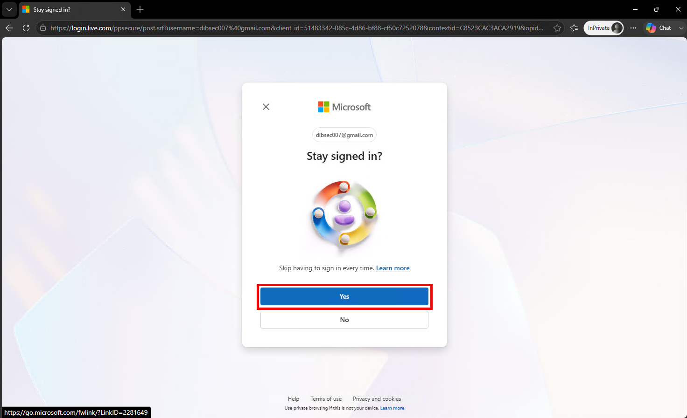
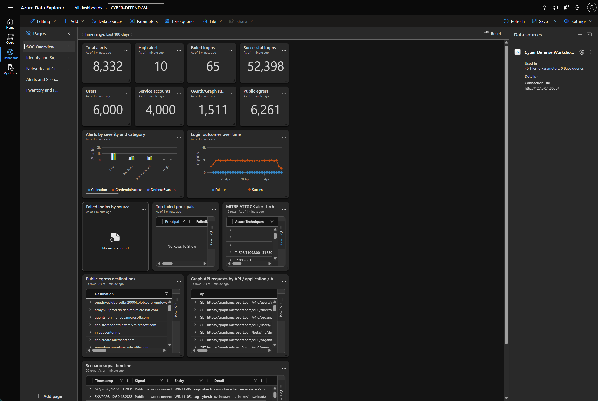
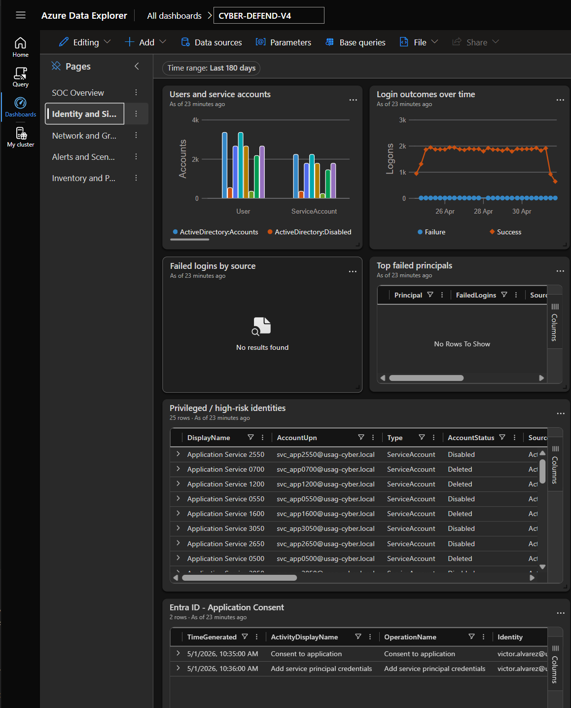
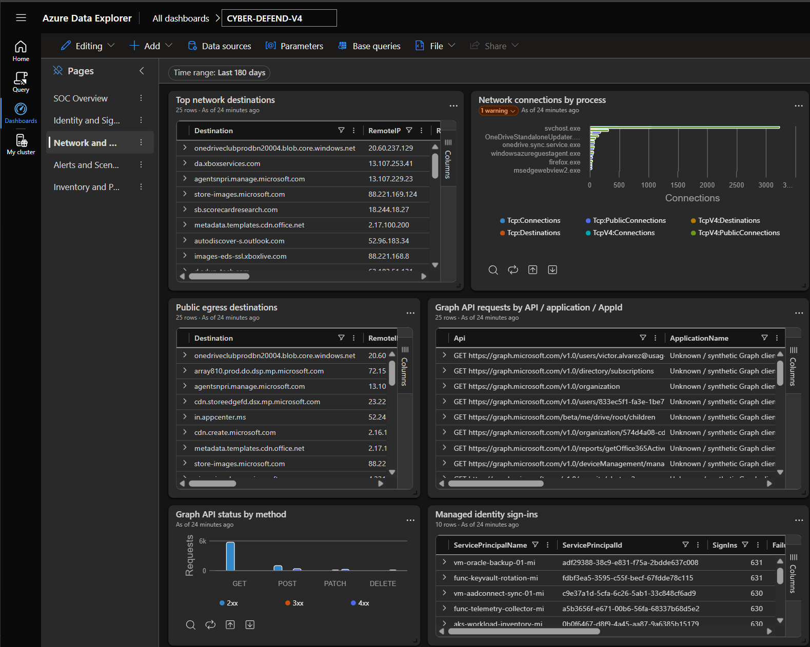
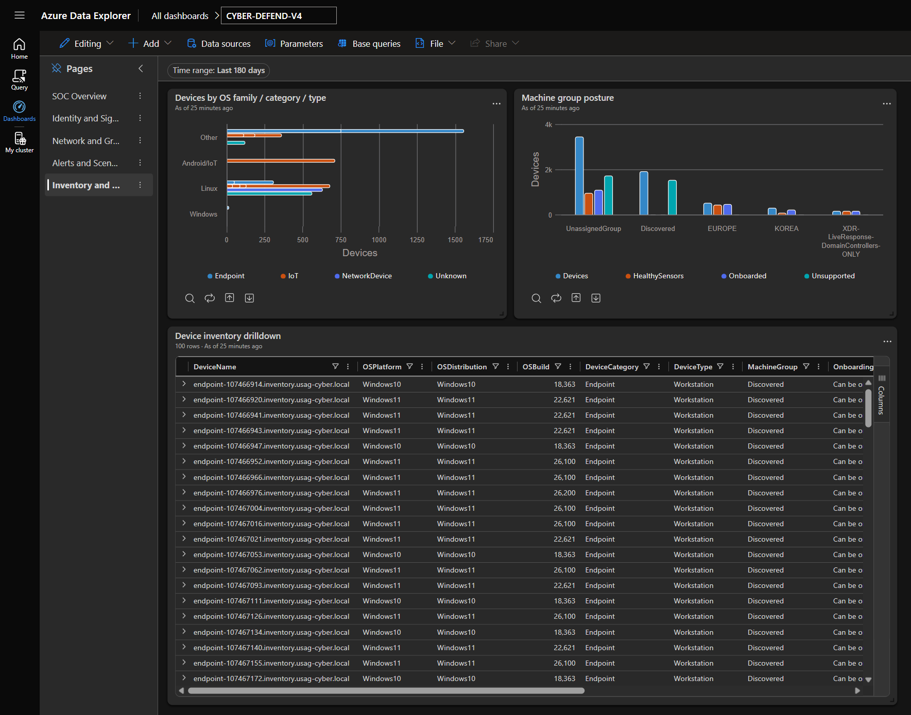

# Student Lab Setup Guide

Use this guide at the workshop to connect your Windows computer to the Cyber Defense lab database. Follow the steps in order and keep the terminal window that runs the local tunnel open until you finish the lab.

## 📋 Before you begin

- Use a Windows computer with an internet connection.
- Have access to a personal Microsoft account that you can use to sign in to Azure Data Explorer.
- Keep the workshop-provided `student-access.env` file and `Start-StudentAdxProxy.ps1` script together in one folder. They are specific to this in-person lab; do not share the credential file.

## 🔌 Set up the local connection

### 1. Install Cloudflare Tunnel

Follow the instructions for your operating system: **Windows** uses `winget`, **MacOS** uses Homebrew (`brew`), **GNU/Linux Debian** uses `apt`.

#### 🪟 Windows Users

1. Open **PowerShell** or **Windows Terminal**.
1. Run this command:

```powershell
winget install --id Cloudflare.cloudflared --exact
```

1. Wait for the installation to finish. If Windows asks for permission, approve it.


<details>
<summary><strong>💻 MacOS Users</strong> &mdash; click to expand the Homebrew steps</summary>

MacOS installs `cloudflared` with **Homebrew**. If you already have Homebrew, skip straight to part 2.

**1. Install Homebrew** (skip if you already have it)

Install it from [brew.sh](https://brew.sh), or run this in **Terminal**:

```bash
/bin/bash -c "$(curl -fsSL https://raw.githubusercontent.com/Homebrew/install/HEAD/install.sh)"
```

On Apple Silicon Macs the installer finishes by printing two `echo` commands that add Homebrew to your `PATH`. Run them, then close and reopen Terminal.

Confirm Homebrew is ready:

```bash
brew --version
```

**2. Update Homebrew, then install `cloudflared`**

```bash
brew update
brew install cloudflared
```

**3. Confirm the installation worked**

```bash
cloudflared --version
```

> ℹ️ The remaining steps show PowerShell prompts because most of the class is on Windows. The `cloudflared` command in step 2 is identical on MacOS &mdash; just run it in Terminal instead.

</details>

<details>
<summary><strong>🐧 GNU/Linux Debian Users</strong> &mdash; click to expand the apt steps</summary>

Debian-based distributions install `cloudflared` from Cloudflare's own apt repository. These steps come from [pkg.cloudflare.com](https://pkg.cloudflare.com/) and cover Debian, Ubuntu, and their derivatives.

**1. Add the Cloudflare GPG key**

```bash
sudo mkdir -p --mode=0755 /usr/share/keyrings
curl -fsSL https://pkg.cloudflare.com/cloudflare-main.gpg | sudo tee /usr/share/keyrings/cloudflare-main.gpg >/dev/null
```

**2. Add the repository, then update and install `cloudflared`**

```bash
echo 'deb [signed-by=/usr/share/keyrings/cloudflare-main.gpg] https://pkg.cloudflare.com/cloudflared any main' | sudo tee /etc/apt/sources.list.d/cloudflared.list
sudo apt-get update && sudo apt-get install cloudflared
```

**3. Confirm the installation worked**

```bash
cloudflared --version
```

> ℹ️ If your machine cannot add third-party apt repositories, install the package directly instead:
>
> ```bash
> curl -L --output cloudflared.deb https://github.com/cloudflare/cloudflared/releases/latest/download/cloudflared-linux-amd64.deb
> sudo dpkg -i cloudflared.deb
> ```
>
> On ARM machines, swap `cloudflared-linux-amd64.deb` for `cloudflared-linux-arm64.deb`.

> ℹ️ The remaining steps show PowerShell prompts because most of the class is on Windows. The `cloudflared` command in step 2 is identical on GNU/Linux &mdash; just run it in your terminal instead.

</details>

### 2. Start the local Cloudflare proxy

1. In the same terminal, change to the folder containing the workshop-provided files.
1. Press **Enter** to start the local connection.
1. Leave this terminal window open. Closing it disconnects the lab database.

```powershell
cloudflared access tcp --hostname adx.tier1-cyberdefense.ai --url 127.0.0.1:8080 --service-token-id d693cceb2da12c0e608489dbb2ceac02.access --service-token-secret 81cd3a66ab62afab8193b39cdf432c8c4db6ae7a08534f0f3e3ddacdca7b8822
```


### 3. Validate the tunnel

Open a **second** PowerShell or Windows Terminal window. Keep the first window running the tunnel. In the second window, run:

```powershell
curl.exe -fsS http://127.0.0.1:8080/v1/rest/ping
```

You should receive a successful response. If the command reports a connection error, make sure the first terminal is still open and ask a workshop instructor for help.


## 🔑 Sign in to Azure Data Explorer

### 4. Open Azure Data Explorer

1. In a browser, open [Azure Data Explorer](https://dataexplorer.azure.com/).
1. If Azure Data Explorer offers to create a free cluster, do not create one.
1. Select **Skip and sign in** in the lower-right corner of the page.


### 5. Enter your personal email address

Enter the email address for the personal Microsoft account you will use during the lab, then continue through the sign-in page.


### 6. Request the sign-in code

When prompted, select the option to send the Azure Data Explorer authentication code to your email address.


### 7. Check your email and enter the code

1. Open the email message from Microsoft in a separate browser tab or mail application.
1. Copy the authentication code.


### 8A. Enter the authentication code

1. Return to the Microsoft sign-in page.
1. Enter the six-digit code from your email, then continue.



### 8B. Choose whether to stay signed in

Microsoft may ask whether you want to stay signed in. Select **Yes** on your personal computer; select **No** on a shared or public computer. You should then return to Azure Data Explorer.



## 🗄️ Add the lab database

### 9. Open the connection menu

1. In Azure Data Explorer, select **Query** from the left navigation if it is not already selected.
1. In the **Connections** pane, select **Add**.


### 10. Enter the local connection details

In the **Add connection** window, enter:

| Field | Value |
| --- | --- |
| Connection URI | `http://127.0.0.1:8080` |
| Display name | `Cyber Defense` |

Select **Add** when both fields are complete.


### 11. Trust the local lab endpoint

Azure Data Explorer will warn that the local address is an untrusted host. This is expected for the workshop connection. Select **Trust**.


### 12. Confirm the address

To confirm the choice, type the address below exactly as shown and select **Trust** again:

```text
http://127.0.0.1:8080
```


### 13. Finish adding the connection

The **Add connection** dialog may appear again after the trust confirmation. Verify that the URI and display name are still correct, then select **Add**.


### 14. Allow the browser prompt

Your browser may ask whether Azure Data Explorer can access other apps and services on this device. Select **Allow** so the browser can use your local lab connection.


### 15. Select a database before querying

If you see an error such as **Query was executed without a database in context**, open a new query tab with the **+** beside the current tab. In the **Connections** pane, expand **Cyber Defense**, then select **CyberDefendStudentSnapshot** to make it the active database.


### 16. Confirm the connection works

When the `CyberDefendStudentSnapshot` database appears under **Cyber Defense**, run this test query:

```kusto
SigninLogs
| take 10
```

Select **Run**. Seeing rows of results confirms that you are connected and ready for the lab.


## ✅ Quick checks

- Keep the terminal running the Cloudflare tunnel open throughout the lab.
- Use `http://127.0.0.1:8080;Fed=false` exactly when Azure Data Explorer asks for the connection URI.
- Select `CyberDefendStudentSnapshot` before you run a query.
- Ask a workshop instructor for help if the tunnel check fails or the database does not appear.

## 📊 Defender Dashboard

Use the Defender Dashboard after completing the connection steps above. It brings together the alert, identity, network, Graph API, and device inventory views needed to move from an initial signal to an evidence-based triage decision.

### Connect the dashboard to the lab data source

The dashboard depends on the same local Cloudflare tunnel as the query experience. Open **Data sources** in the dashboard and confirm that the data source connection URI is:

```text
http://127.0.0.1:8080;Fed=false
```

Azure Data Explorer may display the URI with a trailing `/`; that is expected. Do not replace the local address with the public tunnel hostname, use `https`, or add a path after the port. The local address routes dashboard queries through the tunnel running on your computer.

Before you begin triage:

1. Start the Cloudflare tunnel and leave that terminal window open.
1. Verify the tunnel in a second terminal with `curl.exe -fsS http://127.0.0.1:8080/v1/rest/ping`.
1. Complete the **Trust** and browser **Allow** prompts for the local endpoint.
1. Confirm that `CyberDefendStudentSnapshot` is selected as the active database, then select **Refresh** in the dashboard.

If every dashboard tile fails or stays blank, validate the tunnel first and then recheck the dashboard data source URI. If the tunnel test succeeds but only one tile has no rows, the connection is usually healthy; adjust the global time range and investigate that specific data source or query instead. The workshop uses historical snapshot data, so use the selected time range and event timestamps to sequence activity rather than treating the tile's **As of** label as live telemetry.

### ADX dashboards

The four views below form a practical SOC triage sequence. Set the dashboard-wide time range before comparing tiles, and keep the same window while pivoting between pages.

#### Import the dashboard JSON

In Azure Data Explorer, select **Dashboards** > **New dashboard** > **Import dashboard from file**, then choose [dashboard-CYBER-DEFEND-V4.json](dashboard-CYBER-DEFEND-V4.json). Importing this JSON creates the Defender Dashboard pages and tiles represented by the images below.

The JSON was exported with its authoring cloud data source, so set the lab connection before relying on the tiles:

1. In the imported dashboard, select **Data sources** and edit **Cyber Defense Workshop ADX**.
1. Replace the cluster address with exactly `http://127.0.0.1:8080;Fed=false`.
1. Set the database to `CyberDefendStudentSnapshot`, then save the data source and select **Refresh**.

The address must be the local tunnel endpoint, not the cloud cluster address saved in the JSON. The Cloudflare tunnel must still be running, and the local endpoint must already be trusted in Azure Data Explorer. When the data source is set correctly, the imported dashboard renders the SOC Overview, Identity and Sign-ins, Network and Graph, and Inventory and Posture views shown below.

#### SOC Overview



**Triage callout:** Start with **High alerts**, **Alerts by severity and category**, and the **MITRE ATT&CK** techniques to establish priority and an initial attack hypothesis. Compare failed and successful sign-in trends, then use **Top failed principals**, **Public egress destinations**, **Graph API requests**, and the **Scenario signal timeline** to connect an alert to an identity, device, destination, or application. A large count alone is not proof of compromise; look for a spike, an unusual combination of signals, or activity that does not match the selected time window's baseline.

#### Identity and Sign-ins



**Triage callout:** Investigate a principal when failures concentrate on one user, application, or source and especially when that identity also appears in **Privileged / high-risk identities**. Check the account type and status, assigned roles, criticality, risk level, and related service-account activity before escalating. Treat **Consent to application** and **Add service principal credentials** events as high-value review points: validate the initiating identity, target application, permissions, and timing against the incident.

#### Network and Graph



**Triage callout:** Use **Top network destinations** and **Network connections by process** to identify a device process making unusual public connections. Prioritize rare destinations, unexpected process-to-destination pairs, uncommon ports or protocols, and activity across multiple devices. On the Graph side, review write operations such as `POST`, `PATCH`, and `DELETE`, failed requests, the application or AppId, principal, and client IP. Validate managed-identity sign-ins against the expected workload before deciding whether the activity is suspicious.

#### Inventory and Posture



**Triage callout:** Use this page to determine the affected estate and response coverage. Prioritize devices that are unsupported, not onboarded, missing a healthy sensor, exposed, or in an unexpected machine group. Use **Device inventory drilldown** to capture the device name, operating system, build, machine group, onboarding status, and public IP, then pivot back to the identity, network, and alert pages with that device as the investigation anchor.

### Fast triage pattern

1. Scope the event by setting a focused time range and identifying the highest-severity alert or unusual trend on **SOC Overview**.
1. Validate the identity: identify the user, service principal, application, source IP, and whether the account is privileged or risky.
1. Correlate the identity with public egress, Graph API activity, and the scenario timeline to determine what changed and when.
1. Assess the device's onboarding and sensor posture before recommending containment or further collection.
1. Record the time range, entity names, source data, and the evidence that supports or rules out the suspected behavior so another analyst can reproduce the triage path.
