# Student Lab Setup Guide

Use this guide at the workshop to connect your Windows computer to the Cyber Defense lab database. Follow the steps in order and keep the terminal window that runs the local tunnel open until you finish the lab.

## Before you begin

- Use a Windows computer with an internet connection.
- Have access to a personal Microsoft account that you can use to sign in to Azure Data Explorer.
- Keep the workshop-provided tunnel command available. It is specific to this in-person lab; paste it exactly as supplied by the workshop team and do not edit it.

## Set up the local connection

### 1. Install Cloudflare Tunnel

1. Open **PowerShell** or **Windows Terminal**.
1. Run this command:

```powershell
winget install --id Cloudflare.cloudflared --exact
```

1. Wait for the installation to finish. If Windows asks for permission, approve it.

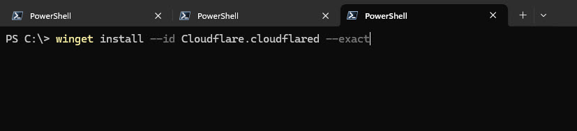

### 2. Start the Cloudflare tunnel

1. In the same terminal, paste the workshop-provided Cloudflare tunnel command exactly as you received it.
1. Press **Enter** to start the local connection.
1. Leave this terminal window open. Closing it disconnects the lab database.

```bash
cloudflared access tcp --hostname adx.tier1-cyberdefense.ai --url 127.0.0.1:8080 --service-token-id d693cceb2da12c0e608489dbb2ceac02.access --service-token-secret 81cd3a66ab62afab8193b39cdf432c8c4db6ae7a08534f0f3e3ddacdca7b8822
```

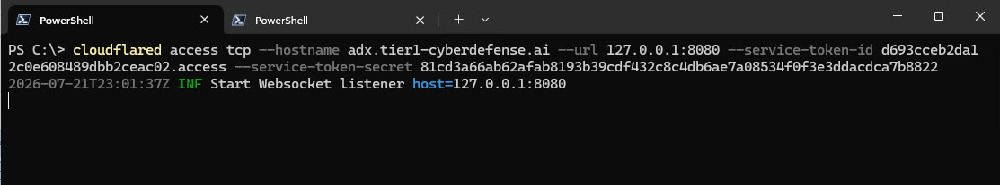

### 3. Validate the tunnel

Open a **second** PowerShell or Windows Terminal window. Keep the first window running the tunnel. In the second window, run:

```powershell
curl.exe -fsS http://127.0.0.1:8080/v1/rest/ping
```

You should receive a successful response. If the command reports a connection error, make sure the first terminal is still open and ask a workshop instructor for help.

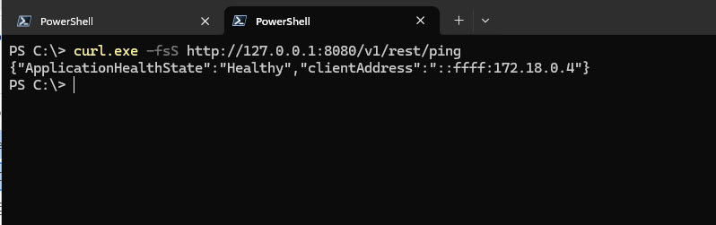

## Sign in to Azure Data Explorer

### 4. Open Azure Data Explorer

1. In a browser, open [Azure Data Explorer](https://dataexplorer.azure.com/).
1. If Azure Data Explorer offers to create a free cluster, do not create one.
1. Select **Skip and sign in** in the lower-right corner of the page.


### 5. Enter your personal email address

Enter the email address for the personal Microsoft account you will use during the lab, then continue through the sign-in page.


### 6. Request the sign-in code

When prompted, select the option to send the Azure Data Explorer authentication code to your email address.

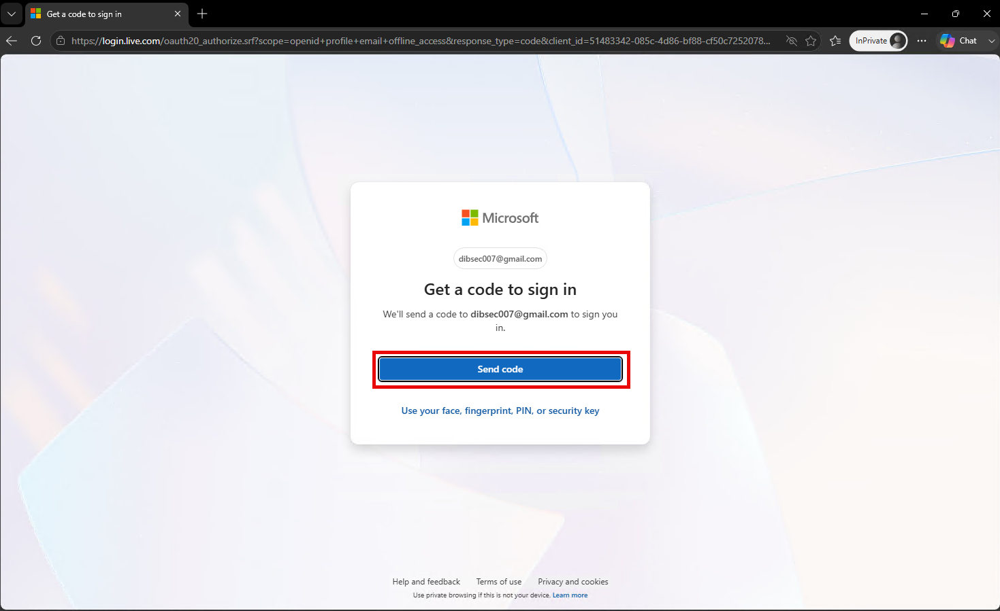

### 7. Check your email and enter the code

1. Open the email message from Microsoft in a separate browser tab or mail application.
1. Copy the authentication code.
1. Return to the sign-in page, paste the code, and continue.

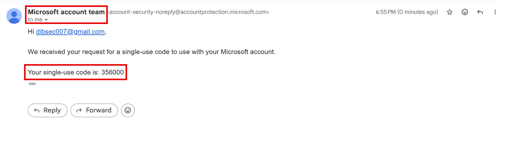

### 8. Complete sign-in

Complete any remaining Microsoft prompts, such as whether to stay signed in. You should then return to Azure Data Explorer.


## Add the lab database

### 9. Open the connection menu

1. In Azure Data Explorer, select **Query** from the left navigation if it is not already selected.
1. In the **Connections** pane, select **Add**.

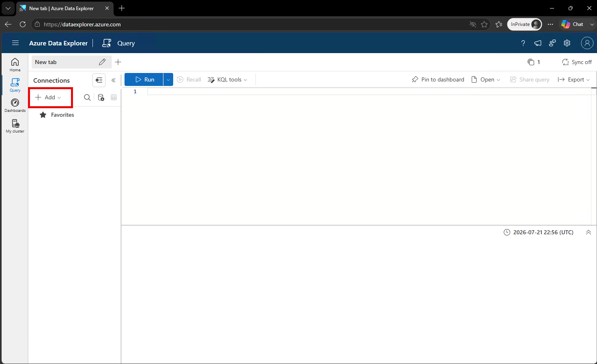

### 10. Enter the local connection details

In the **Add connection** window, enter:

| Field | Value |
| --- | --- |
| Connection URI | `http://127.0.0.1:8080` |
| Display name | `Cyber Defense` |

Select **Add** when both fields are complete.

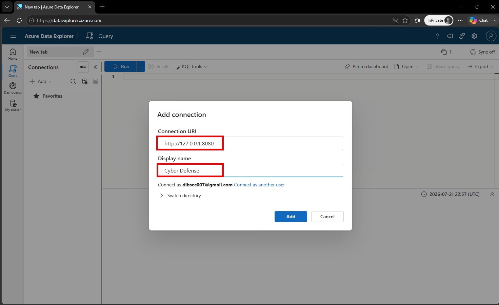

### 11. Trust the local lab endpoint

Azure Data Explorer will warn that the local address is an untrusted host. This is expected for the workshop connection. Select **Trust**.

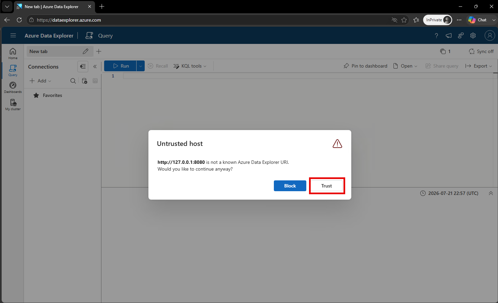

### 12. Confirm the address

To confirm the choice, type the address below exactly as shown and select **Trust** again:

```text
http://127.0.0.1:8080
```

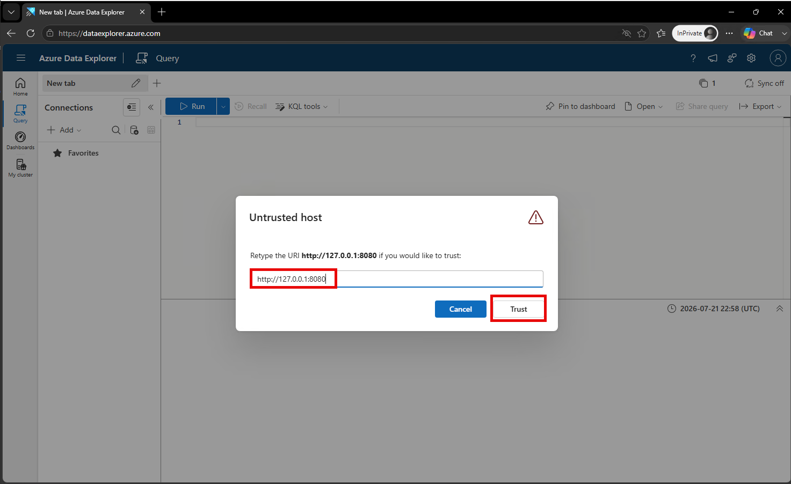

### 13. Finish adding the connection

The **Add connection** dialog may appear again after the trust confirmation. Verify that the URI and display name are still correct, then select **Add**.


### 14. Allow the browser prompt

Your browser may ask whether Azure Data Explorer can access other apps and services on this device. Select **Allow** so the browser can use your local lab connection.

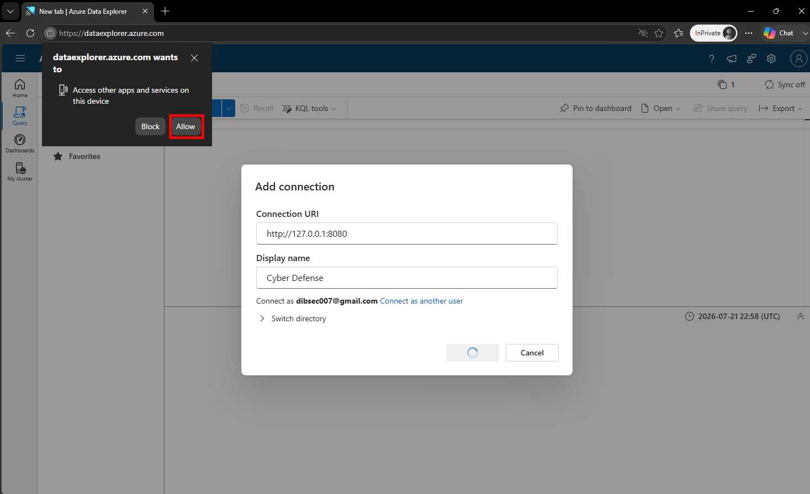

### 15. Select a database before querying

If you see an error such as **Query was executed without a database in context**, open a new query tab with the **+** beside the current tab. In the **Connections** pane, expand **Cyber Defense**, then select **CyberDefendStudentSnapshot** to make it the active database.

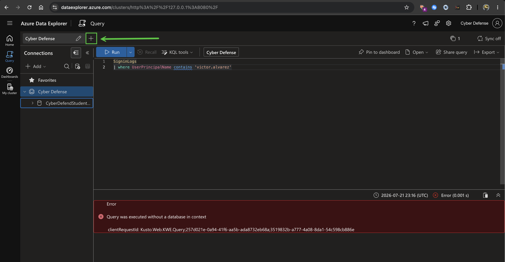

### 16. Confirm the connection works

When the `CyberDefendStudentSnapshot` database appears under **Cyber Defense**, run this test query:

```kusto
SigninLogs
| take 10
```

Select **Run**. Seeing rows of results confirms that you are connected and ready for the lab.

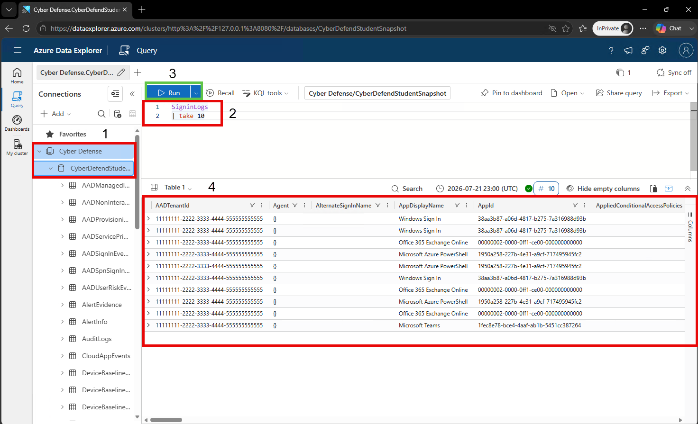

## Quick checks

- Keep the terminal running the Cloudflare tunnel open throughout the lab.
- Use `http://127.0.0.1:8080` exactly when Azure Data Explorer asks for the connection URI.
- Select `CyberDefendStudentSnapshot` before you run a query.
- Ask a workshop instructor for help if the tunnel check fails or the database does not appear.
