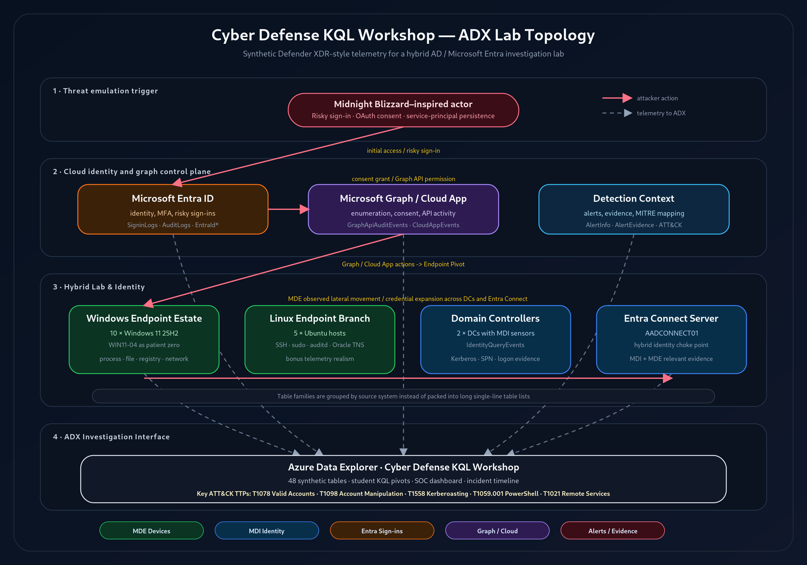

# Cyber Defense KQL Workshop: Investigating a Hybrid Identity Intrusion with XDR Telemetry

**Author:** Lorenzo J. Ireland

**Date:** May 14, 2026

## Abstract

Modern intrusions rarely stay inside a single telemetry source. A risky cloud sign-in can become an OAuth persistence problem, a Microsoft Graph collection path, an endpoint credential-access investigation, and eventually a hybrid identity lateral-movement case. This hands-on workshop teaches defenders how to investigate that full chain using Kusto Query Language (KQL) in Azure Data Explorer (ADX), backed by realistic synthetic Microsoft security telemetry rather than live production data.

Participants investigate a MIDNIGHT BLIZZARD-inspired scenario against a notional hybrid AD and Microsoft Entra ID environment. The attack begins with a compromised user and risky Entra sign-in, then moves through suspicious OAuth consent, service-principal credential abuse, Microsoft Graph activity, endpoint credential harvesting, Kerberoasting, LSASS access, and service-account activity against an Entra Connect server. Optional Linux telemetry adds Ubuntu MDE, SSH, sudo, package vulnerability, and Oracle access pivots for teams that want broader endpoint realism.

The lab is built for repeatable delivery: schemas, synthetic NDJSON telemetry, ADX table creation, ingestion scripts, student access helpers, dashboards, instructor guidance, and student KQL content are included. Students work across Defender XDR-style device, identity, cloud app, Graph, sign-in, alert, and vulnerability-management tables, then correlate events into a defensible incident timeline mapped to MITRE ATT&CK.

Attendees leave with practical KQL investigation patterns, a clearer understanding of which Microsoft telemetry sources answer which defender questions, and a reusable model for building safe, high-fidelity cyber defense training without exposing real environments or sensitive logs.

## Session Details

- Format: Hands-on workshop or instructor-led technical session
- Length: 90 to 120 minutes
- Audience: SOC analysts, detection engineers, incident responders, threat hunters, security architects, and instructors building cyber defense labs
- Skill level: Intermediate; basic familiarity with Microsoft security portals, identity concepts, and query languages is helpful

## Learning Outcomes

By the end of this session, participants will be able to:

1. Use KQL to orient across ADX tables modeled after Microsoft Defender, Microsoft Entra ID, Microsoft Graph, CloudAppEvents, and alert telemetry.
2. Correlate sign-in, OAuth, Graph, endpoint, identity, vulnerability, and alert evidence into a single attack timeline.
3. Recognize credential-access and hybrid identity tradecraft and map observed behaviors to MITRE ATT&CK.
4. Explain which telemetry sources are most useful for investigating risky sign-ins, OAuth abuse, service-principal persistence, endpoint credential harvesting, Kerberos activity, and lateral movement.
5. Reuse the lab design pattern to deliver safe, synthetic, repeatable cyber defense training in ADX.

## Suggested Track Tags

- Cloud Security
- Detection Engineering
- Incident Response
- Threat Hunting
- Identity Security
- Microsoft Security
- KQL
- Purple Team / Training Lab

## Workshop Topology

This SOC dashboard is useful because it gives analysts a shared operational view of the same hybrid identity intrusion they investigate in the workshop, bringing alert volume, affected users, risky sign-ins, endpoint evidence, cloud activity, and timeline pivots into one place. For SOCs, that matters because cyber defense depends on quickly moving from isolated signals to correlated decisions: which identity is compromised, which device or service principal matters, what evidence confirms the scope, and where responders should hunt next. By grounding those decisions in Azure and XDR backed telemetry and KQL-driven views, the dashboard helps teams triage faster, preserve investigative context, and practice the same detection, correlation, and response habits they need during real incidents.

