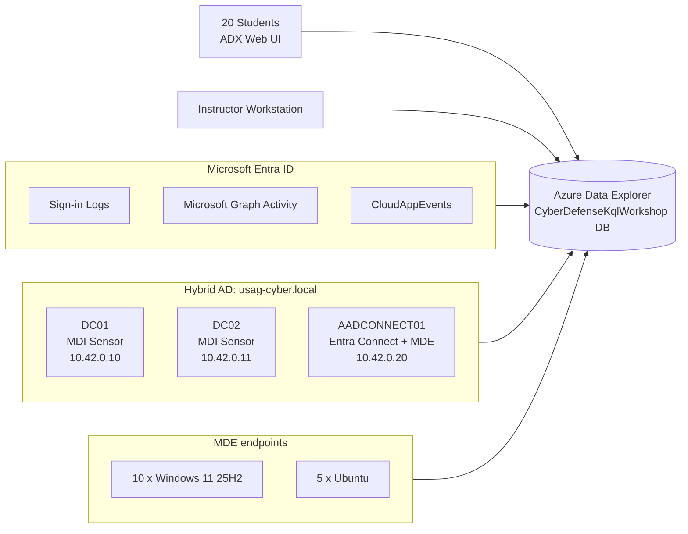
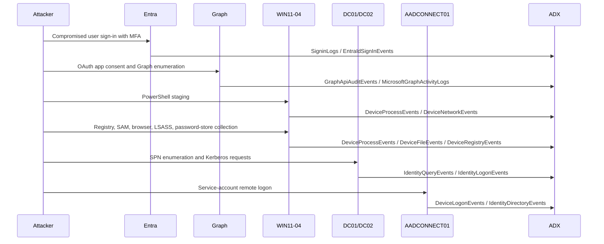
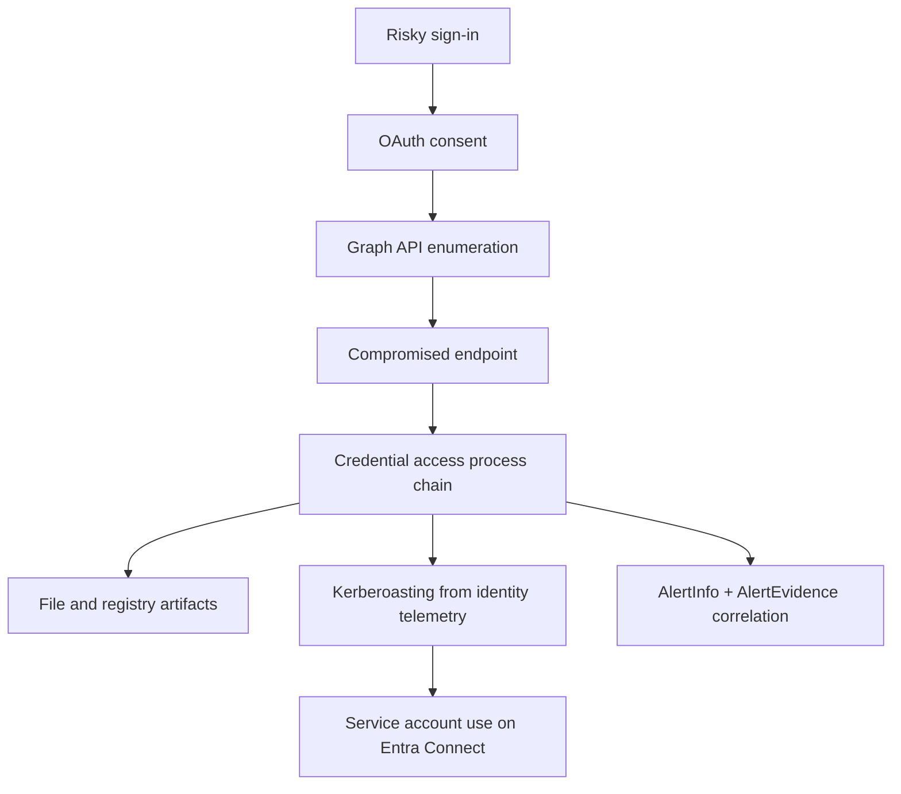

# Workshop diagrams

## Hybrid lab topology

```mermaid
flowchart LR
    Students[20 Students<br/>ADX Web UI] --> ADX[(Azure Data Explorer<br/>CyberDefenseKqlWorkshop DB)]
    Instructor[Instructor Workstation] --> ADX

    subgraph Entra[Microsoft Entra ID]
        Signins[Sign-in Logs]
        Graph[Microsoft Graph Activity]
        CloudApp[CloudAppEvents]
    end

    subgraph OnPrem[Hybrid AD: usag-cyber.local]
        DC01[DC01<br/>MDI Sensor<br/>10.42.0.10]
        DC02[DC02<br/>MDI Sensor<br/>10.42.0.11]
        AADC[AADCONNECT01<br/>Entra Connect + MDE<br/>10.42.0.20]
    end

    subgraph Endpoints[MDE endpoints]
        Win[10 x Windows 11 25H2]
        Linux[5 x Ubuntu]
    end

    Entra --> ADX
    OnPrem --> ADX
    Endpoints --> ADX
```

## Attack storyline

```mermaid
sequenceDiagram
    participant Attacker
    participant Entra
    participant Graph
    participant WIN11 as WIN11-04
    participant DC as DC01/DC02
    participant AADC as AADCONNECT01
    participant ADX

    Attacker->>Entra: Compromised user sign-in with MFA
    Entra->>ADX: SigninLogs / EntraIdSignInEvents
    Attacker->>Graph: OAuth app consent and Graph enumeration
    Graph->>ADX: GraphApiAuditEvents / MicrosoftGraphActivityLogs
    Attacker->>WIN11: PowerShell staging
    WIN11->>ADX: DeviceProcessEvents / DeviceNetworkEvents
    Attacker->>WIN11: Registry, SAM, browser, LSASS, password-store collection
    WIN11->>ADX: DeviceProcessEvents / DeviceFileEvents / DeviceRegistryEvents
    Attacker->>DC: SPN enumeration and Kerberos requests
    DC->>ADX: IdentityQueryEvents / IdentityLogonEvents
    Attacker->>AADC: Service-account remote logon
    AADC->>ADX: DeviceLogonEvents / IdentityDirectoryEvents
```

## Investigation pivots

```mermaid
flowchart TD
    A[Risky sign-in] --> B[OAuth consent]
    B --> C[Graph API enumeration]
    C --> D[Compromised endpoint]
    D --> E[Credential access process chain]
    E --> F[File and registry artifacts]
    E --> G[Kerberoasting from identity telemetry]
    G --> H[Service account use on Entra Connect]
    E --> I[AlertInfo + AlertEvidence correlation]
```
