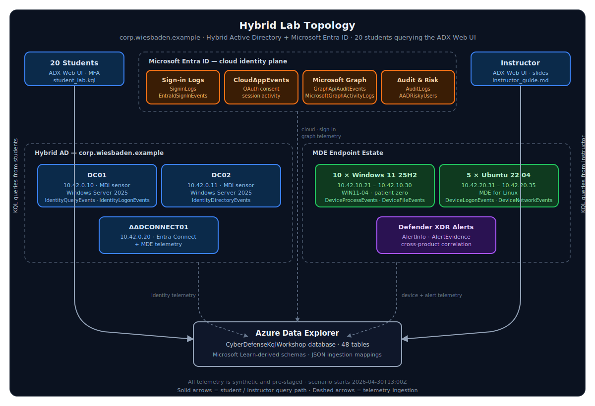
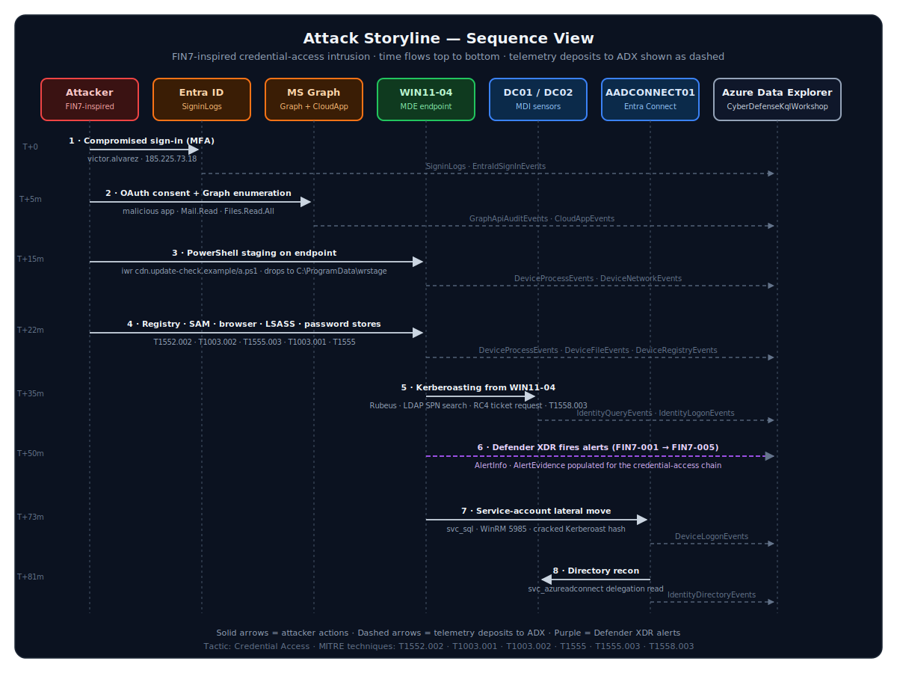
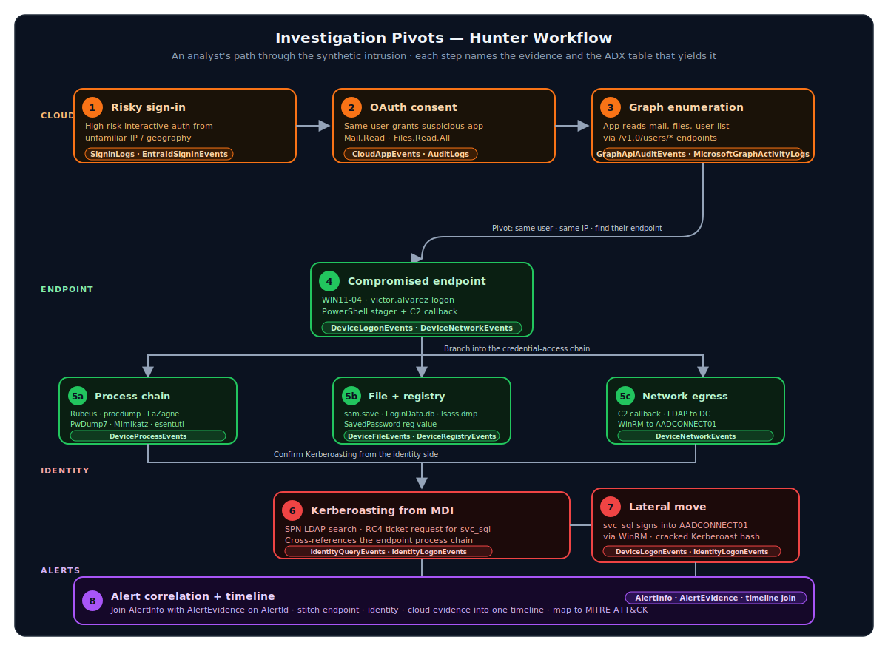

# Workshop diagrams

Three diagrams describe the workshop from three angles: where the lab lives, how the attack unfolds, and how a hunter pivots through the resulting telemetry.

## Hybrid lab topology

Where the data comes from. Twenty students and the instructor query an ADX database that holds synthetic telemetry from a hybrid Active Directory / Microsoft Entra ID environment. The cloud identity plane sits at the top, the on-prem hybrid AD enclave and MDE endpoint estate sit side by side in the middle, and ADX collects everything at the bottom.

## Attack storyline

How the FIN7-inspired intrusion unfolds in time. Each lifeline is an actor or system; each numbered solid arrow is an attacker action; each dashed arrow shows where that action deposits telemetry into ADX. Read top to bottom — the time axis on the left marks scenario minutes (`T+0` through `T+81m`).

## Investigation pivots

How an analyst works through the evidence. The flow starts in the cloud (risky sign-in → OAuth consent → Graph enumeration), pivots to the compromised endpoint, branches into three parallel hunts (process chain, file/registry artifacts, network egress), corroborates from the identity tier, and ends with alert correlation. Each card names the ADX table that yields the evidence for that step.

