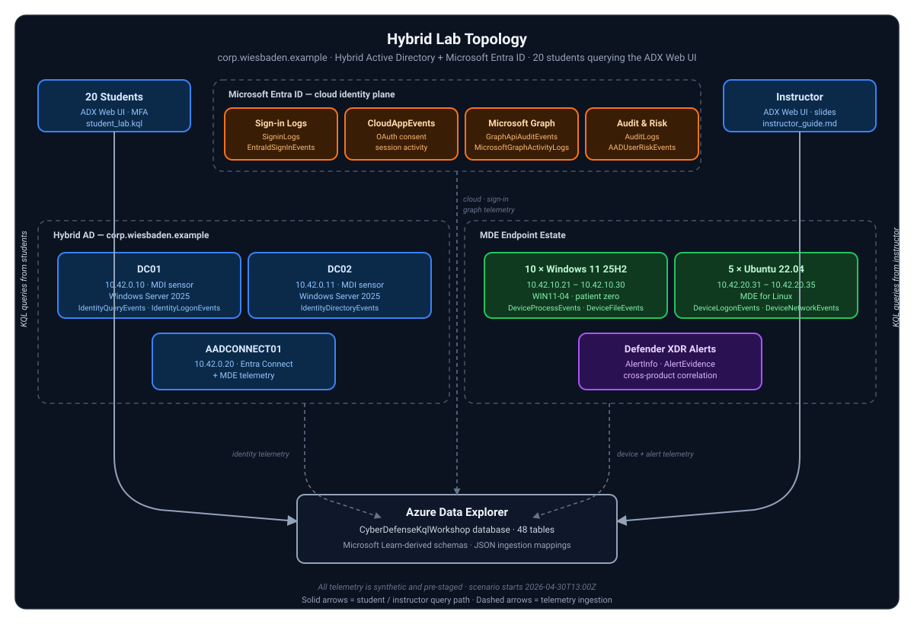
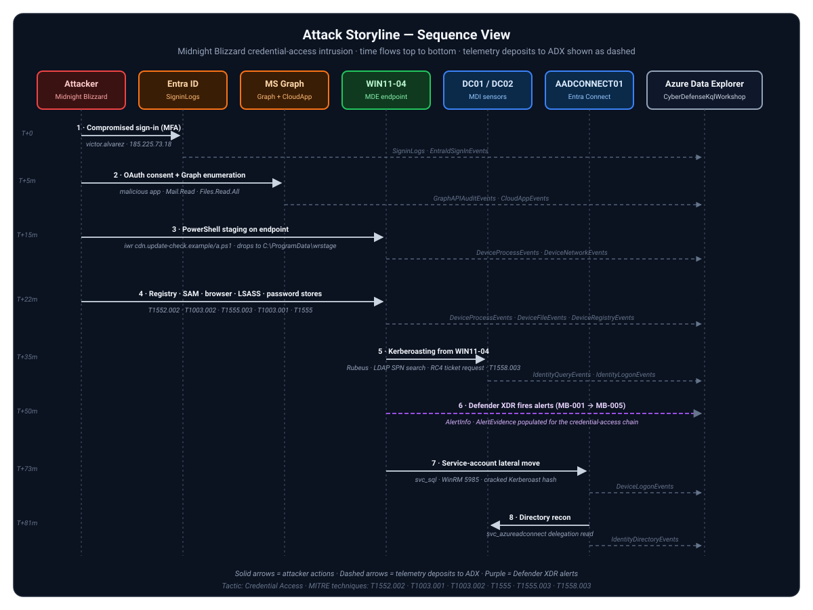
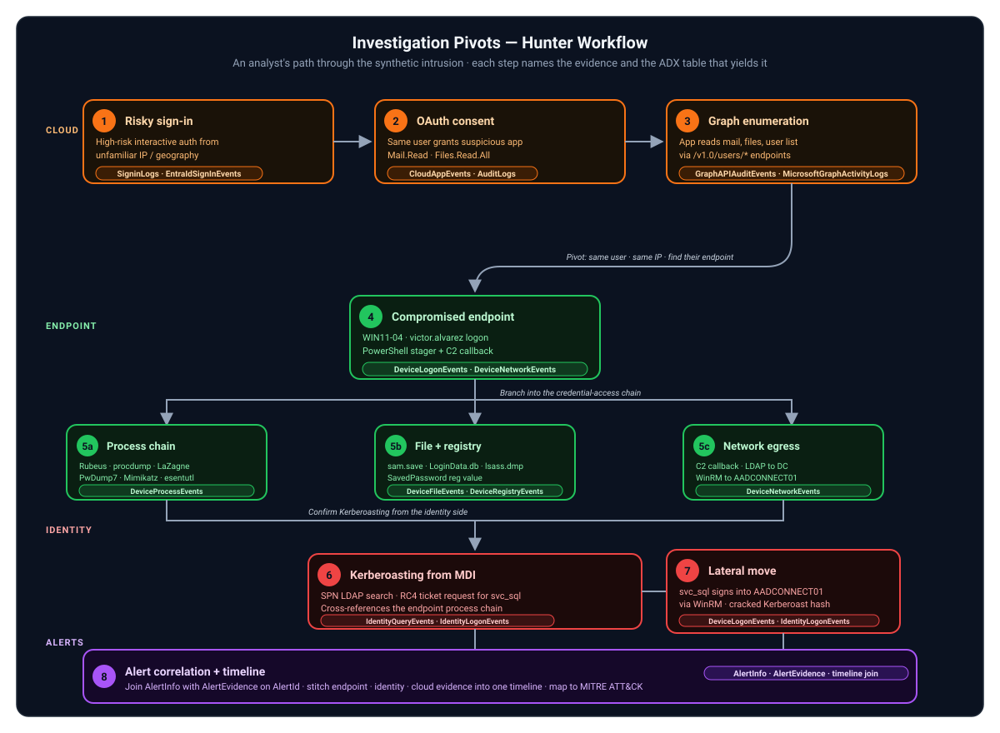

# Workshop diagrams

Three diagrams describe the workshop from three angles: where the lab lives, how the attack unfolds, and how a hunter pivots through the resulting telemetry.

## Hybrid lab topology

Where the data comes from. A class of 5 to 100 students plus the instructor query an ADX database that holds synthetic telemetry from a hybrid Active Directory / Microsoft Entra ID environment. The cloud identity plane sits at the top, the on-prem hybrid AD enclave and MDE endpoint estate sit side by side in the middle, and ADX collects everything at the bottom.

## Attack storyline

How the Midnight Blizzard-inspired intrusion unfolds in time. Each lifeline is an actor or system; each numbered solid arrow is an attacker action; each dashed arrow shows where that action deposits telemetry into ADX. Read top to bottom — the time axis on the left marks scenario minutes. The sequence opens on the device-code phish that delivers the token, runs through OAuth persistence, Graph collection, endpoint credential access, Kerberoasting, and the hybrid pivot, and ends with cloud collection and exfiltration.

For background on Midnight Blizzard tradecraft and how the steps below map to real-world TTPs, see [`docs/threat-actor-midnight-blizzard.md`](threat-actor-midnight-blizzard.md).

## Investigation pivots

How an analyst works through the evidence. The flow starts with the phishing delivery and the device-code sign-in it produces, pivots through OAuth consent and Graph enumeration, moves to the compromised endpoint, branches into three parallel hunts (process chain, file/registry artifacts, network egress), corroborates from the identity tier, and ends with exfiltration evidence and alert correlation. Each card names the ADX table that yields the evidence for that step.

