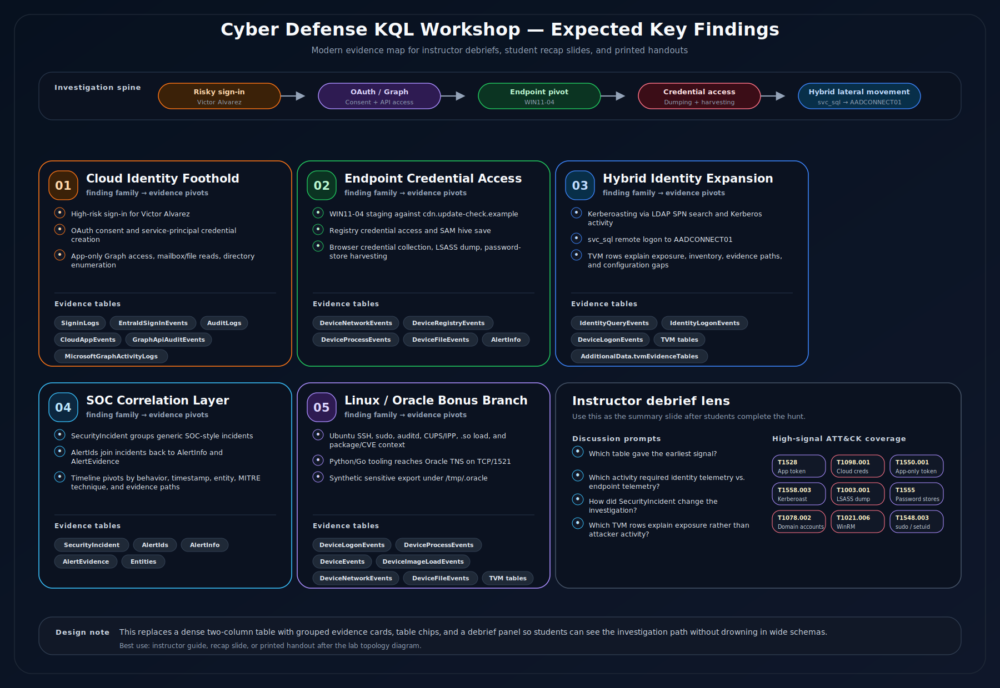
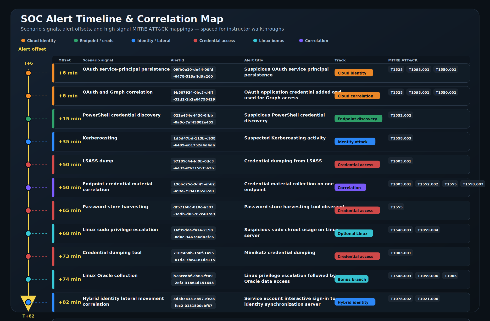

# Instructor guide

## Setup checklist

1. Confirm the ADX cluster exists.
2. Run `scripts\Initialize-Workshop.ps1` to create the database, tables, mappings, generated data, and ingestion.
3. Create or stage the 20 student accounts using `scripts\New-WorkshopStudents.ps1`.
4. Grant the student group ADX database viewer access using `scripts\Grant-StudentAdxAccess.ps1`.
5. Open the ADX Web UI URL and confirm the database is visible.
6. Load `workshop\student_lab.kql` in the query editor.

## Instructor storyline

Start with the sign-in. Students should find a high-risk interactive sign-in for `victor.alvarez@usag-cyber.local` from `185.225.73.18`, followed by OAuth consent, service-principal credential creation, app-only Microsoft Graph access, and Graph enumeration/collection. The endpoint pivot is `WIN11-04.usag-cyber.local`. The credential-access chain begins with PowerShell staging and progresses through registry credential discovery, SAM hive save, browser database copy, Kerberoasting, LSASS dump, password-store harvesting, and Mimikatz-style credential dumping. Keep the tool names visible because they cover the required screenshot vectors, but frame them as follow-on credential expansion after the Midnight Blizzard-style identity/OAuth foothold. The identity pivot is the service account `svc_sql`, which is later used against `AADCONNECT01`. `SecurityIncident` should be introduced as the SOC incident queue: incident titles are generic and analyst-friendly, while `AlertIds` and `AdditionalData` tie the incidents back to the scenario evidence and supporting TVM tables.

Use the Ubuntu branch as an optional comparison pivot after the Windows path is understood. Students should see that `UBUNTU-03.usag-cyber.local` emits MDE device telemetry, not MDI telemetry: SSH/PAM logons in `DeviceLogonEvents`, `sudo` and shell execution in `DeviceProcessEvents`, audit artifacts in `DeviceEvents` and `DeviceFileEvents`, Linux `.so` image loads in `DeviceImageLoadEvents`, CUPS/IPP network context in `DeviceNetworkEvents`, and Linux package/CVE context in TVM tables. The additive Oracle branch stages a synthetic Python helper and Go binary on `UBUNTU-03`, connects to Oracle TNS on `UBUNTU-05:1521`, and creates a synthetic sensitive export under `/tmp/.oracle`.

## Pacing and scope control

| Track | Use in class | Time guidance |
| --- | --- | --- |
| Must-find cloud identity path | Acts 2-4d: risky sign-in, OAuth consent, service-principal credential addition, Graph access | Do not skip. This is the strongest Midnight Blizzard alignment. |
| Must-find Windows credential path | Acts 5-10: endpoint process/file/registry, Kerberoasting, `svc_sql` to `AADCONNECT01`, alert join, timeline | Keep tool names visible, but emphasize technique families and follow-on credential expansion. |
| SOC incident correlation | Act 9 and final timeline: `SecurityIncident` to `AlertInfo`/`AlertEvidence`, plus TVM evidence tables in `AdditionalData` | Make clear that incident names are not actor-branded; the value is the grouping and pivots. |
| Optional Linux telemetry comparison | Act 11 | Use if the class is moving quickly or if Linux MDE telemetry is a learning goal. |
| Optional Linux/Oracle collection | Act 12 | Treat as a bonus branch; do not let it displace the cloud identity investigation. |

## Expected key findings

## Instructor-only alert answer key

Do not put these IDs on the student slides. The generated `AlertId` values are intentionally opaque so students learn to hunt by behavior, title, timestamp, entity, MITRE technique, `SecurityIncident.AlertIds`, and `AlertEvidence`, not by actor-branded IDs.

Use [`workshop\instructor_alert_answer_key.kql`](../workshop/instructor_alert_answer_key.kql) as the corresponding instructor-only query pack. It contains the static AlertId answer key plus the cloud, endpoint, identity, incident, TVM, Linux/Oracle, and full-timeline pivots needed to tell the scenario story.

## Facilitation tips

- Keep students in pairs if login troubleshooting takes more than a few minutes.
- Encourage `project` and `summarize` early so students do not drown in wide schemas.
- Let students try pivots before revealing the next table.
- When students find a process, ask: "What identity is tied to it? What host? What network or file artifact follows?"

## Suggested debrief questions

1. Which table gave the earliest signal?
2. Which credential-access technique had the strongest endpoint evidence?
3. Which activity required identity telemetry rather than endpoint telemetry?
4. How did `SecurityIncident` change the investigation compared with starting directly in `AlertInfo`?
5. Which TVM rows helped explain exposure or hardening gaps rather than attacker activity?
6. What prevention or hardening would have reduced the blast radius?
7. What detections would you operationalize after this hunt?
8. How does Linux MDE telemetry differ from Windows endpoint and MDI identity telemetry?
9. Which Linux evidence distinguishes ordinary SSH administration from privilege escalation and Oracle data collection?
