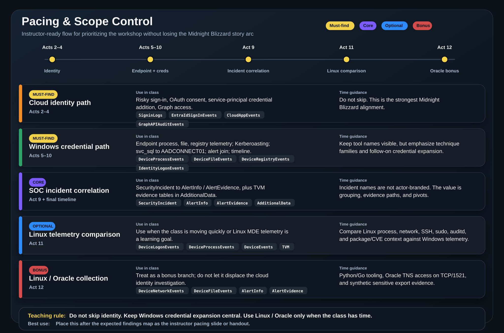
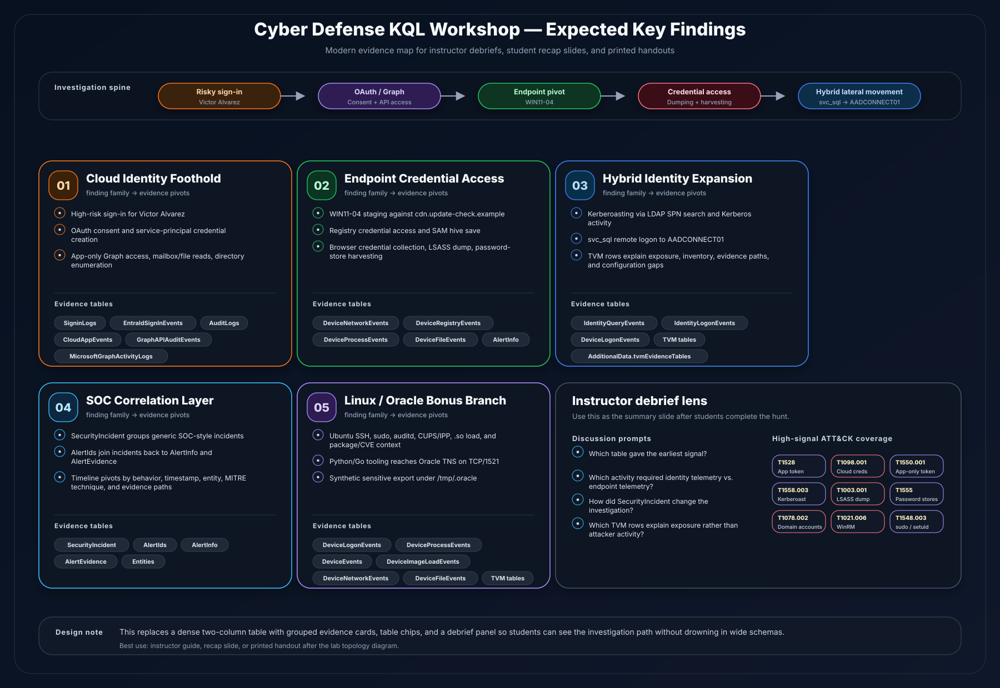
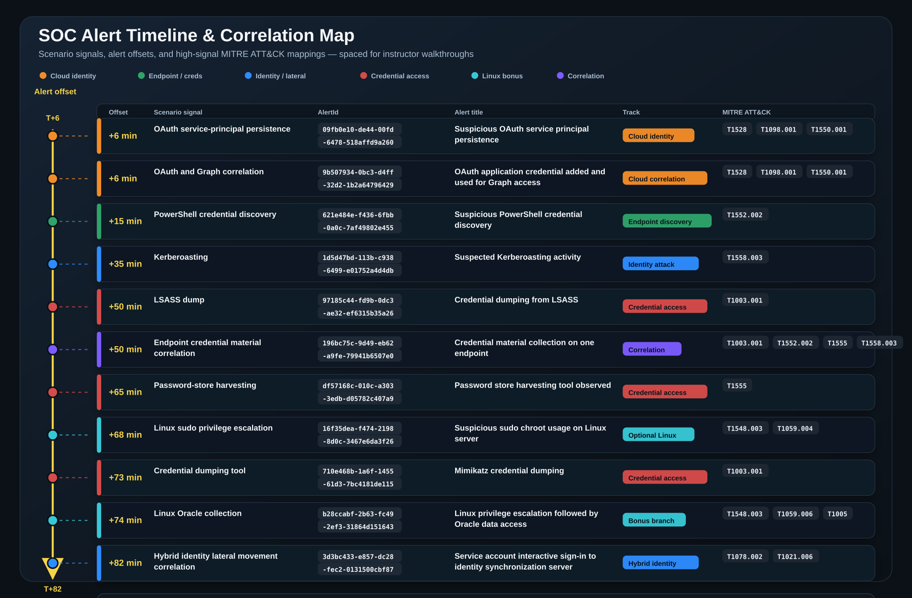

# Instructor guide

> **Primary delivery path:** Use the containerized class lab and [Shared Class Credential Guide](cloudflare_adx_access.md) for security conferences with mixed or random participants. Distribute the temporary shared credential and student proxy script, have students connect through `http://127.0.0.1:8080`, and verify the `kusto-readonly-gateway` service is healthy.
>
> **Secondary delivery path:** Use managed Azure ADX plus B2B participant setup only when the event requires per-person identity governance, tenant access policy, and managed ADX database authorization.

## Primary conference setup checklist

1. Start the Docker host with `docker compose up --detach --wait kusto` for the initial setup.
2. Run `scripts\Copy-StudentAdxToLocalKusto.ps1 -ForceRecreate` to build and validate the local Student snapshot.
3. Run `scripts\Start-CloudflareAdxTunnel.ps1 -Apply` to create the temporary shared Service Auth route and start the connector.
4. Rebuild the gateway from source with `docker compose up --detach --build kusto-readonly-gateway`. The gateway is a `build:` service, so a plain `docker compose up` reuses whatever image was built last and silently serves a stale policy.
5. Confirm `kusto-readonly-gateway` is healthy with `docker compose ps` and validate a pilot student proxy connection. Health only proves the process is listening, so also confirm the policy is live: `.show tables` must succeed and `.show queries` must return 403.
6. Distribute only `student-access.env`, `Start-StudentAdxProxy.ps1`, and the student lab instructions through the temporary class channel.
7. Have students import `STUDENT-GUIDES\dashboard-CYBER-DEFEND-V4.json` as their dashboard; keep `dashboards\cyber-defense-workshop-dashboard.kql` open in the query editor for pinning tiles manually, and `docs\instructor_answer_key.kql` in a second tab for yourself.

Before an intentional Kustainer replacement, run `docker compose stop kusto`, `scripts\Backup-LocalKustoSnapshot.ps1`, and `docker compose start kusto`; copy the resulting ZIP to secure storage. Rehearse the restore before the event with `scripts\Restore-LocalKustoSnapshot.ps1`, which rebuilds the database in a throwaway container and reconciles the row counts. If the snapshot is lost on site, rebuild it without Azure by running `scripts\Restore-LocalKustoSnapshot.ps1 -ExtractPayloadTo .\data\generated` followed by `scripts\Import-GeneratedDataToKustainer.ps1`.

## Secondary managed Azure checklist

1. Confirm the ADX cluster exists.
2. Run `scripts\Initialize-Workshop.ps1` to create the database, tables, mappings, generated data, and ingestion.
3. Create or confirm the participant security group and B2B access package described in `user_creation\README.md`.
4. Grant the participant group ADX database viewer access using `scripts\Grant-StudentAdxAccess.ps1` or an equivalent Kusto management command.
5. Share the ADX dashboard with the participant group using dashboard `Can view` permission.
6. Open the ADX Web UI URL with a pilot participant account and confirm the database, dashboard, and query results are visible.
7. Have participants import `STUDENT-GUIDES\dashboard-CYBER-DEFEND-V4.json`; keep `dashboards\cyber-defense-workshop-dashboard.kql` open in the query editor for manual tile pinning, and `docs\instructor_answer_key.kql` in a second tab for yourself.

## Instructor storyline

The intrusion runs as thirteen acts, numbered 0-12 to match the deck and [`docs\instructor_answer_key.kql`](instructor_answer_key.kql).

**Do not start at the sign-in.** Acts 0 and 1 orient the room: confirm the connection, then walk the terrain so students already know why `AADCONNECT01` and the two domain controllers matter before anyone touches them.

The intrusion opens at **Act 2** with delivery. A device-code phishing mail reaches `victor.alvarez@usag-cyber.local` from `secure-docs@usag-cyber-portal.example`, and its lure points at the *genuine* `microsoft.com/devicelogin`. Blocking the domain would not have helped, and ZAP quarantines the mail only after the token has already been issued. **Act 3** is the redemption from `185.225.73.18` on an unmanaged, non-compliant device using the `deviceCode` protocol and Microsoft Azure CLI. MFA was satisfied; make the point explicitly that MFA is not the control that failed here.

**Act 4 is the strongest teaching beat in the deck. Do not skip it.** `alice.weber` performs a legitimate device-code sign-in from `198.51.100.50` on a compliant, Azure AD joined device, earlier in wall-clock time than the attack. Students who alert on `AuthenticationProtocol == deviceCode` alone will flag her instead of the attacker. That is the point.

**Act 5** covers OAuth consent for `USAG Cyber Sync Helper` (unverified publisher, `Mail.Read` + `Files.Read.All` + `Directory.ReadWrite.All`), the service-principal credential add that survives a password reset, and the app-only Microsoft Graph enumeration and collection that follows. Ask the room what response action actually evicts the attacker.

**Acts 6 and 7** are the endpoint. The pivot is `WIN11-04.usag-cyber.local`, staging under `C:\ProgramData\wrstage` with C2 to `cdn.update-check.example` (`203.0.113.77`). The credential-access chain runs registry credential discovery, SAM hive save, browser database copy, LSASS dump, password-store harvesting, and Mimikatz-style credential dumping. Keep the tool names visible because they cover the required screenshot vectors, but frame them as follow-on credential expansion after the Midnight Blizzard-style identity/OAuth foothold.

**Act 8** is Kerberoasting: `servicePrincipalName` LDAP queries in `IdentityQueryEvents`, then 4769 service-ticket requests with RC4 in `SecurityEvent`. **Act 9** is the highest-impact pivot, the service account `svc_sql` reaching `AADCONNECT01` over WinRM.

**Acts 10-12 close the case.** Act 10 establishes impact with storage account key listing, bulk blob read via `azcopy`, and `MailItemsAccessed`, so the class ends on data actually moving rather than on credential theft. Act 11 joins `ThreatIntelIndicators` against the attacker IP and C2 host the students already found by hand, teaching TI as a join rather than a separate silo. Act 12 lands in Defender XDR: introduce `SecurityIncident` as the SOC incident queue, where titles are generic and analyst-friendly while `AlertIds` and `AdditionalData` tie the incidents back to the scenario evidence and supporting TVM tables.

Use the Ubuntu branch as an optional comparison pivot after the Windows path is understood. Students should see that `UBUNTU-03.usag-cyber.local` emits MDE device telemetry, not MDI telemetry: SSH/PAM logons in `DeviceLogonEvents`, `sudo` and shell execution in `DeviceProcessEvents`, audit artifacts in `DeviceEvents` and `DeviceFileEvents`, Linux `.so` image loads in `DeviceImageLoadEvents`, CUPS/IPP network context in `DeviceNetworkEvents`, and Linux package/CVE context in TVM tables. The additive Oracle branch stages a synthetic Python helper and Go binary on `UBUNTU-03`, connects to Oracle TNS on `UBUNTU-05:1521`, and creates a synthetic sensitive export under `/tmp/.oracle`.

## Pacing and scope control

The workshop runs 120 minutes in seven segments: frame and access check (10), phish and device code including the benign twin (20), OAuth consent and Graph (20), endpoint credential access (30), Kerberoast and hybrid pivot (20), cloud exfil plus threat intel and XDR (15), debrief (5). The full agenda is in [`docs\workshop_design.md`](workshop_design.md).

## Expected key findings

## Instructor-only alert answer key

Do not put these IDs on the student slides. The generated `AlertId` values are intentionally opaque so students learn to hunt by behavior, title, timestamp, entity, MITRE technique, `SecurityIncident.AlertIds`, and `AlertEvidence`, not by actor-branded IDs.

Use [`docs\instructor_answer_key.kql`](instructor_answer_key.kql) as the corresponding instructor-only query pack. It contains the static AlertId answer key plus the device-code phishing, cloud, endpoint, identity, incident, threat intelligence, exposure, and full-timeline pivots needed to tell the scenario story, along with a facilitation checklist of the questions students actually ask.

Two things to know before you present from it. The AlertIds in that file are stable across regeneration, but the timestamps are not, because the generator anchors the scenario to the moment it runs. Query 00 derives the scenario window dynamically for exactly that reason, so run it first. Every query in the file has been executed against a live Kusto engine, and the ones whose tables are newer than the local snapshot were validated against their schemas.

## Facilitation tips

- Keep students in pairs if login troubleshooting takes more than a few minutes.
- Encourage `project` and `summarize` early so students do not drown in wide schemas.
- Let students try pivots before revealing the next table.
- When students find a process, ask: "What identity is tied to it? What host? What network or file artifact follows?"

## Suggested debrief questions

1. Which table gave the earliest signal?
2. Which credential-access technique had the strongest endpoint evidence?
3. Which activity required identity telemetry rather than endpoint telemetry?
4. How did `SecurityIncident` change the investigation compared with starting directly in `AlertInfo`?
5. Which TVM rows helped explain exposure or hardening gaps rather than attacker activity?
6. What prevention or hardening would have reduced the blast radius?
7. What detections would you operationalize after this hunt?
8. How does Linux MDE telemetry differ from Windows endpoint and MDI identity telemetry?
9. Which Linux evidence distinguishes ordinary SSH administration from privilege escalation and Oracle data collection?
