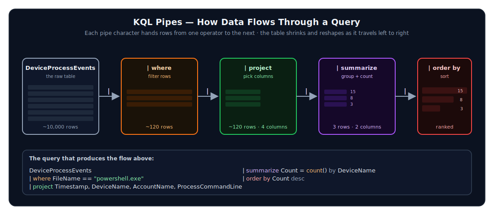
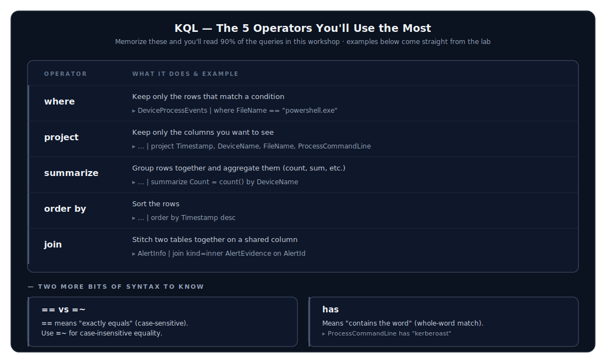
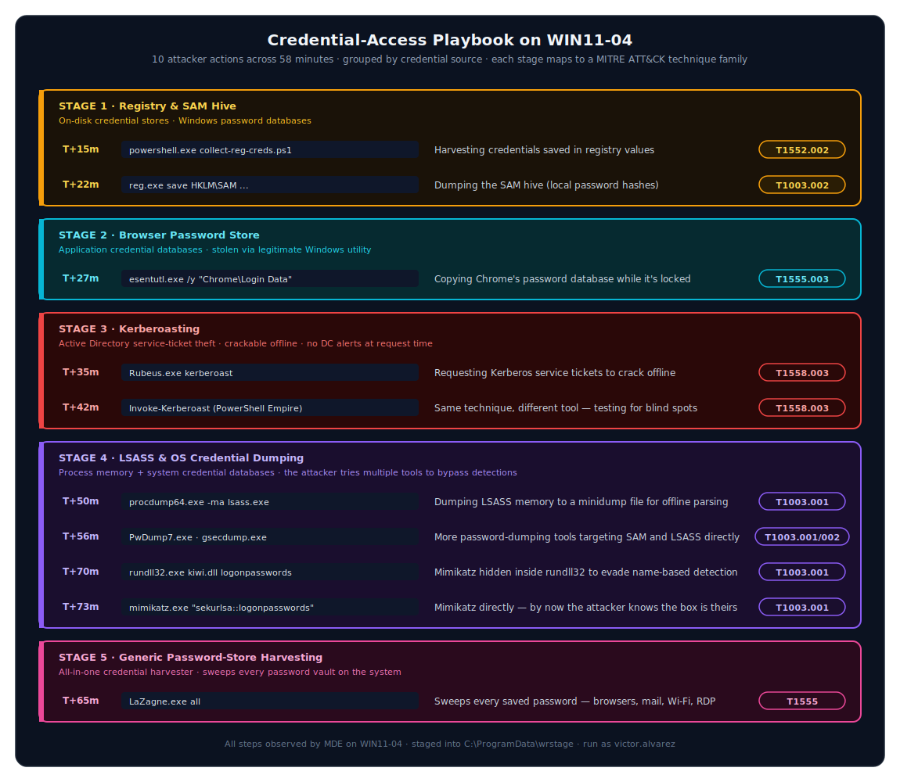
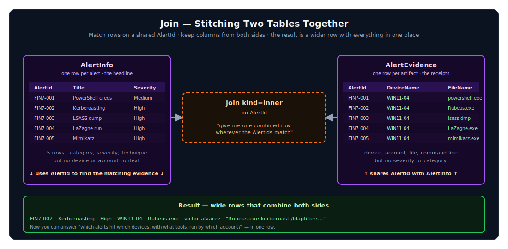
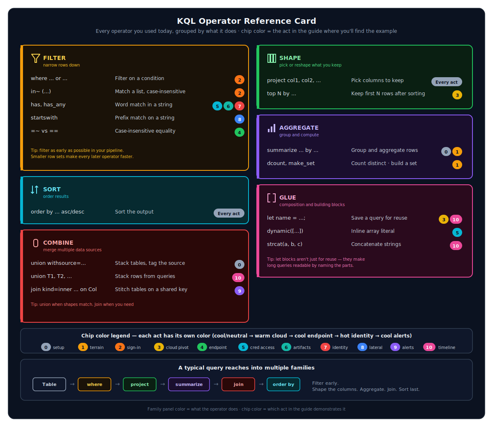

# Student Guide — Cyber Defense KQL Workshop

Welcome. Over the next two hours you're going to investigate a credential-access intrusion against a notional organization called **USAG Cyber**. You'll do it the way a real Defender XDR analyst would — by writing KQL queries against telemetry already loaded into Azure Data Explorer (ADX). No live attack, no production systems, just you, the data, and a story to uncover.

This guide walks alongside [`student_lab.kql`](student_lab.kql). Every query in this guide is in that file too — the `.kql` file is your scratchpad, and this guide is your story. Read a section, run the query, look at what comes back, then read the next section.

> **Going at your own pace.** If you finish a section early, try the "Stretch" prompts at the end of each act. If you fall behind, skip to the next act — the story still makes sense.

---

## Before we start — what is KQL, really?

KQL (Kusto Query Language) is built around one idea: **data flows through a pipeline, one operator at a time.** You start with a table, then you pipe (`|`) the rows from one operator to the next, and each operator transforms them.



If you've used Linux shell pipes (`grep | awk | sort`), KQL will feel familiar. If you haven't, here's the mental model:

- A **table** is a giant list of rows. `DeviceProcessEvents` is a table.
- A **pipe** (`|`) hands all the rows from one step to the next.
- An **operator** does something to those rows: filter them (`where`), pick columns (`project`), count them (`summarize`), sort them (`order by`).

The five operators you'll use the most, plus all the others, are documented in the operator reference card you'll see in a moment.



Two more bits of syntax to know:

- `==` means "exactly equals" (case-sensitive). Use `=~` for case-insensitive.
- `has` means "contains the word" (e.g., `ProcessCommandLine has "kerberoast"`).

That's the entire foundation. Everything else is detail.

> **One more thing.** ADX is forgiving — if your query has a typo, it'll tell you exactly what's wrong and where. Don't be afraid to break things.

---

## The scenario in one paragraph

A user named **Victor Alvarez** had his account compromised by an attacker emulating **Midnight Blizzard** tradecraft. The attacker signed in from an unfamiliar IP, granted themselves access to mailbox and file data via a malicious OAuth app, then pivoted to Victor's workstation (`WIN11-04`). On that endpoint they ran a credential-access playbook — registry creds, SAM hive dump, browser passwords, LSASS memory dump, Kerberoasting, password-store harvesting tools, Mimikatz. They cracked a service-account hash from the Kerberoasting and used it to reach `AADCONNECT01`, the Entra Connect server.

> **About the threat actor.** Midnight Blizzard (also tracked as APT29 / Cozy Bear, attributed by multiple Western governments to Russia's SVR) is one of the most active state-sponsored adversaries targeting Microsoft cloud environments. The tradecraft you'll see today — risky sign-in → malicious OAuth app consent → Graph enumeration → hybrid identity pivot — is a direct echo of the real-world Microsoft and HPE breaches in 2023–2024. For attribution, recent activity, and the full TTP-to-MITRE mapping that backs every query in this guide, see [`docs/threat-actor-midnight-blizzard.md`](../docs/threat-actor-midnight-blizzard.md).

Your job is to find every step. Let's go.

---

## Act 0 — Are we connected?

Before anything else, confirm you can see the data. Open the ADX Web UI, make sure the database `CyberDefenseKqlWorkshop` is selected in the left panel, and run this:

```kql
union withsource=TableName
    DeviceInfo,
    IdentityInfo,
    SigninLogs,
    CloudAppEvents,
    GraphApiAuditEvents,
    DeviceProcessEvents,
    IdentityQueryEvents,
    AlertInfo,
    AlertEvidence
| summarize Rows=count() by TableName
| order by TableName asc
```

You should get nine rows back, one per table, each with a row count. If a table shows zero rows or you get an error, raise your hand.

**What's happening here?** `union` stacks rows from multiple tables on top of each other. `withsource=TableName` adds a column telling you which table each row came from. Then we count by table to inventory what we have.

---

## Act 1 — Know your terrain

Before chasing the attacker, let's understand the lab. Where do hosts live? What's high value?

```kql
DeviceInfo
| summarize Hosts=dcount(DeviceId), Devices=make_set(DeviceName, 100) by OSPlatform, DeviceType, MachineGroup, AssetValue
| order by AssetValue desc, Hosts desc
```

You'll see:

- **2 domain controllers** in the `Domain Controllers` group, marked `AssetValue = High` — these are crown jewels.
- **1 Entra Connect server** in `Identity Tier 0` — also crown jewels (it can sync passwords to the cloud).
- **10 Windows 11 endpoints** in `Workstations` and **5 Ubuntu hosts** in `Linux Servers`.

> **Mentor moment.** `dcount` means "distinct count" — it counts unique values, not total rows. `make_set(DeviceName, 100)` collects up to 100 unique device names into an array, so you see *which* devices, not just *how many*. These two functions are the fastest way to summarize a column.

**Stretch:** Add `IsInternetFacing` to the `summarize ... by` clause. Anything internet-facing in this lab? (Spoiler: no — but verify it.)

---

## Act 2 — Find the suspicious sign-in

The intrusion starts in the cloud. An identity provider sees the attacker first, before any endpoint does. So that's where we start.

```kql
SigninLogs
| where IsRisky == true or RiskLevelDuringSignIn in~ ("high", "medium")
| project TimeGenerated, UserPrincipalName, IPAddress, AppDisplayName, AuthenticationMethodsUsed, ConditionalAccessStatus, RiskLevelDuringSignIn, RiskState, UserAgent
| order by TimeGenerated asc
```

**What we expect to see:** one row, for `victor.alvarez@usag-cyber.local`, signing in from IP `185.225.73.18`, with risk level `high`.

**Why this query works:**

- `where IsRisky == true or RiskLevelDuringSignIn in~ ("high", "medium")` — Microsoft Entra ID flags risky sign-ins for us; we just have to ask. The `in~` operator is "case-insensitive in this list."
- `project` shows only the columns that matter for triage. Resist the urge to do `| project *` — wide rows are hard to read.
- `order by TimeGenerated asc` puts the earliest event first, so we're reading the story in the right direction.

**Write this down somewhere:**

- **User:** `victor.alvarez@usag-cyber.local`
- **IP:** `185.225.73.18`
- **Time:** the timestamp from your row

You'll use all three about ten more times today.

> **Mentor moment.** This is the analyst's first habit: **anchor on identifiers**. Once you know the suspect user, IP, and time window, every subsequent query starts from one of those three.

---

## Act 3 — Follow the IP, not just the user

The same IP that did the suspicious sign-in might have done other things in the same minute. Let's check OAuth consent and Graph API activity.

We'll build this query in two pieces so you can see the technique.

**First, grab the suspicious IP into a variable:**

```kql
let suspiciousIp =
    SigninLogs
    | where IsRisky == true
    | top 1 by TimeGenerated asc
    | project IPAddress;
```

**What's happening here?** `let` defines a named query you can reuse. `top 1 by TimeGenerated asc` keeps just the earliest matching row. `project IPAddress` reduces it to a single-column result. Now `suspiciousIp` is a tiny dataset containing one IP address — and we can use it as a filter in other queries.

**Now use it to hunt OAuth consent:**

```kql
let suspiciousIp =
    SigninLogs
    | where IsRisky == true
    | top 1 by TimeGenerated asc
    | project IPAddress;
CloudAppEvents
| where IPAddress in (suspiciousIp)
| project Timestamp, AccountDisplayName, AccountId, ActionType, ObjectName, OAuthAppId, RawEventData
| order by Timestamp asc
```

You should find **`OAuthAppConsentGranted`** for an app called **"USAG Cyber Sync Helper"**, with scopes `Mail.Read Files.Read.All offline_access`. That's the attacker installing a backdoor app that survives password resets — exactly the persistence pattern Midnight Blizzard used in the 2024 Microsoft and HPE breaches.

**And the Graph API calls that came after:**

```kql
let suspiciousIp =
    SigninLogs
    | where IsRisky == true
    | top 1 by TimeGenerated asc
    | project IPAddress;
GraphApiAuditEvents
| where IpAddress in (suspiciousIp)
| project Timestamp, AccountObjectId, ApplicationId, RequestMethod, RequestUri, Scopes, ResponseStatusCode
| order by Timestamp asc
```

You'll see the app pulling Victor's mailbox messages, his OneDrive root, and the tenant user list. Reconnaissance.

> **Mentor moment.** Notice how we used `let` to pivot. You filtered the entire `CloudAppEvents` table down to just rows from the same IP as the risky sign-in — without ever hardcoding the IP. This is the cleanest way to chain investigations.

**Stretch:** Run the same pattern against `MicrosoftGraphActivityLogs`. Do you see the same calls from a different angle?

---

## Act 4 — Land on the endpoint

The attacker has cloud access. Now they need a foothold. We know the compromised user — let's see what *their* endpoint did.

```kql
let compromisedUser = "victor.alvarez@usag-cyber.local";
let firstRiskySignin =
    toscalar(SigninLogs
    | where UserPrincipalName =~ compromisedUser and IsRisky == true
    | summarize min(TimeGenerated));
DeviceProcessEvents
| where AccountUpn =~ compromisedUser
| where Timestamp between (firstRiskySignin .. firstRiskySignin + 2h)
| project Timestamp, DeviceName, FileName, ProcessCommandLine, InitiatingProcessFileName, AdditionalFields
| order by Timestamp asc
```

You'll see process activity on **`WIN11-04.usag-cyber.local`** starting around the same time as the cloud activity — PowerShell with hidden window style and `-ExecutionPolicy Bypass`, dropping files into `C:\ProgramData\wrstage`.

**Why `=~` instead of `==`?** The double-equals is case-sensitive. The squiggle-equals is case-insensitive. UPNs in the wild can have mixed case (`Victor.Alvarez@...`), and you don't want to miss a match because of capitalization.

> **Mentor moment.** `WIN11-04` is now your patient zero. Combine that with Victor's UPN and the IP from Act 2, and you've got the three keys to unlock the rest of the investigation.

---

## Act 5 — The credential-access playbook

This is the meat of the intrusion. The attacker ran nearly a dozen credential-access tools, each mapped to a MITRE ATT&CK technique. We don't need to know the names of all of them — we just need to spot the patterns.

Here's a query that hunts the attack vectors using both **filenames** and **suspicious command-line text**:

```kql
let suspiciousTools = dynamic(["reg.exe", "esentutl.exe", "Rubeus.exe", "procdump64.exe", "PwDump7.exe", "gsecdump.exe", "lazagne.exe", "mimikatz.exe", "rundll32.exe"]);
DeviceProcessEvents
| where FileName in~ (suspiciousTools)
   or ProcessCommandLine has_any ("kerberoast", "sam.save", "LoginData.db", "logonpasswords", "pwdump", "gsecdump", "lazagne")
| project Timestamp, DeviceName, AccountUpn, FileName, ProcessCommandLine
| order by Timestamp asc
```

Read down the result set. You'll see ten distinct credential-access actions, each one targeting a different place where Windows or its applications store passwords. The picture below groups those actions into the **five credential sources** the attacker went after — same data your query returned, organized by *what's being stolen* rather than just *when*:



**A few things to notice as you read it:**

- **The attacker tried multiple tools per family.** Two Kerberoasting tools (Rubeus + PowerShell Empire). Four LSASS / OS-credential-dumping tools (procdump, PwDump7+gsecdump, obfuscated mimikatz, plain mimikatz). That's not random — it's the attacker testing for which tools your EDR catches and which it misses. **Defenders should expect this.** A single detection rule covering one tool is not enough.
- **Stages 1, 2, and 5 are after credentials *at rest*** — passwords sitting in the registry, in Chrome's database, in any vault LaZagne knows about. These steal credentials without ever touching memory.
- **Stages 3 and 4 are after credentials *in transit or in memory*** — Kerberos tickets and LSASS process memory. These are the high-value targets because they often contain credentials for accounts the user hasn't even saved locally.
- **The MITRE family is shown as a colored badge** matching each stage's color. Use these technique IDs when you write up your incident — they're the universal vocabulary for credential access.

**Why `dynamic([...])`?** It builds an array literal you can pass to `in~`. Cleaner than chaining `or FileName == "x" or FileName == "y"`.

**Why `has_any`?** It returns true if *any* of the keywords appear in the column. Faster and more readable than chaining `contains` operators.

> **Mentor moment.** Real attackers rename tools. `Rubeus.exe` might be `update.exe`. So we hunt with **two lenses**: the filename (catches the lazy attackers) and the command line (catches the careful ones). Both approaches together catch most of them.

---

## Act 6 — Find the artifacts they left behind

Processes are ephemeral. The files and registry values they create stick around. Two queries — one for registry, one for filesystem.

**Registry:**

```kql
DeviceRegistryEvents
| where RegistryKey has_any ("VPN", "Run", "Winlogon") or RegistryValueName has_any ("SavedPassword", "DefaultPassword")
| project Timestamp, DeviceName, RegistryKey, RegistryValueName, RegistryValueData, InitiatingProcessFileName, InitiatingProcessCommandLine
| order by Timestamp asc
```

You should find a `SavedPassword` value under `HKEY_CURRENT_USER\Software\WiesbadenResearch\VPN` — exactly the kind of "credentials in registry" anti-pattern T1552.002 targets.

**Filesystem:**

```kql
DeviceFileEvents
| where FolderPath has @"C:\ProgramData\wrstage"
| project Timestamp, DeviceName, ActionType, FileName, FolderPath, InitiatingProcessFileName, InitiatingProcessCommandLine
| order by Timestamp asc
```

You'll see the smoking guns dropped into `C:\ProgramData\wrstage`:

- `sam.save`, `system.save` — the SAM hive dumps
- `LoginData.db` — Chrome's password database
- `lsass.dmp` — the LSASS minidump
- `cred_bundle.zip` — the attacker zipping it all up for exfiltration

**Why `@"..."`?** The `@` prefix tells KQL "this is a verbatim string — don't interpret backslashes as escape characters." Without it, you'd have to write `"C:\\ProgramData\\wrstage"`.

> **Mentor moment.** When investigating, **always check both the action and the residue**. A process event tells you a tool ran. A file event proves it succeeded.

---

## Act 7 — Confirm Kerberoasting from the identity side

The endpoint told us `Rubeus` ran. But did the domain controller actually issue Kerberos tickets? That's where MDI telemetry comes in.

**LDAP queries asking for SPNs:**

```kql
IdentityQueryEvents
| where Query has "servicePrincipalName" or AdditionalFields has "T1558.003"
| project Timestamp, AccountUpn, DeviceName, IPAddress, DestinationDeviceName, QueryType, Query, Application, AdditionalFields
| order by Timestamp asc
```

You should see two LDAP searches from `WIN11-04` to `DC01` looking for `servicePrincipalName=*` — that's the Kerberoasting reconnaissance step. One from `Rubeus`, one from `PowerShell Empire`.

**Kerberos ticket activity:**

```kql
IdentityLogonEvents
| where Protocol =~ "Kerberos" or AdditionalFields has "ServicePrincipalName"
| project Timestamp, AccountUpn, DeviceName, IPAddress, DestinationDeviceName, DestinationPort, TargetAccountDisplayName, AdditionalFields
| order by Timestamp asc
```

Look for the row where `victor.alvarez` requests a service ticket targeting `SQL Reporting Service` (`svc_sql`) with `RC4_HMAC` encryption. RC4 is the encryption type Kerberoasting attackers want, because it's crackable offline.

> **Mentor moment.** Endpoint telemetry shows the *intent* (Rubeus ran). Identity telemetry shows the *outcome* (a Kerberos ticket was actually issued). When you can show both, you have a tight investigation.

---

## Act 8 — The lateral move

A cracked service account is only useful if the attacker can *use* it somewhere. Let's see if `svc_sql` showed up where it shouldn't.

```kql
DeviceLogonEvents
| where AccountName startswith "svc_"
| where DeviceName has "AADCONNECT01" or RemoteDeviceName has "WIN11-04" or LogonType =~ "RemoteInteractive"
| project Timestamp, DeviceName, ActionType, LogonType, AccountDomain, AccountName, RemoteDeviceName, RemoteIP, Protocol, IsLocalAdmin
| order by Timestamp asc
```

You should see `svc_sql` performing a `RemoteInteractive` (WinRM) logon to `AADCONNECT01.usag-cyber.local` from `WIN11-04` — about 80 minutes after the original sign-in. That's the lateral move, and it's a big deal: `AADCONNECT01` is the server that syncs on-prem AD passwords to Entra ID. From there, the attacker could potentially compromise the entire hybrid identity. **This is exactly the kind of seam — between on-prem and cloud — that Midnight Blizzard targets in real-world intrusions.**

> **Mentor moment.** A service account that signs in *interactively* from a *workstation* is almost always wrong. Service accounts should run as services, not as people. `LogonType == "RemoteInteractive"` for an `svc_*` account is a high-fidelity detection signal.

---

## Act 9 — Connect the alerts to the evidence

Defender XDR raised five core Windows/hybrid identity alerts during this incident. Each alert is a one-line summary in `AlertInfo`, with the gory details in `AlertEvidence`. To get the full picture, we **join** them.

Joins are how you stitch two tables together using a shared column. Here's the picture:



The query:

```kql
AlertInfo
| where AlertId startswith "MIDNIGHT-BLIZZARD-"
| join kind=inner AlertEvidence on AlertId
| project Timestamp=Timestamp1, AlertId, Title=Title1, Severity=Severity1, ServiceSource=ServiceSource1, AttackTechniques=AttackTechniques1, EntityType, DeviceName, AccountUpn, FileName, ProcessCommandLine
| order by Timestamp asc
```

A few things going on here:

- **`join kind=inner ... on AlertId`** — keep only rows where the same `AlertId` exists in both tables. (`kind=inner` is the most common; it means "intersection.")
- **`Timestamp=Timestamp1`** — when both tables have a column called `Timestamp`, the join names them `Timestamp` and `Timestamp1` to disambiguate. We're saying "give me the one from the right side and call it `Timestamp`."
- The result is a wide row that has the alert headline (from `AlertInfo`) *and* the artifact details (from `AlertEvidence`) together.

You'll get one row per piece of evidence per alert — about 5 rows total — and each row tells you both *what triggered* and *what fired it*.

> **Mentor moment.** This is the most important pattern in Defender XDR hunting. `AlertInfo` is "what." `AlertEvidence` is "why we think so." You almost never want one without the other.

**Stretch:** Try `kind=leftouter` instead of `kind=inner`. What changes? (Hint: rows from `AlertInfo` that have no matching evidence will still appear, with empty columns on the right.)

---

## Act 10 — Build the timeline

Final exercise. We've collected evidence from four different telemetry sources — endpoint processes, identity queries, cloud OAuth events, and alerts. Let's stitch them into one chronological story.

This is a *long* query, but it's just the same pattern repeated four times. We'll use `let` blocks to define each stream, then `union` them into a single timeline.

**Build it up step by step.** First, define the endpoint stream:

```kql
let endpoint =
    DeviceProcessEvents
    | where DeviceName has "WIN11-04"
    | where FolderPath has @"C:\ProgramData\wrstage" or ProcessCommandLine has_any ("kerberoast", "sam.save", "LoginData.db", "logonpasswords", "pwdump", "gsecdump", "lazagne")
    | project Timestamp, SourceTable="DeviceProcessEvents", Entity=DeviceName, Detail=strcat(FileName, " :: ", ProcessCommandLine);
```

**Notice two new tricks:**

- `SourceTable="DeviceProcessEvents"` creates a literal column with a fixed value. This is how you tag rows so you know which table they came from after you union them.
- `strcat(...)` glues strings together. Here we're combining the filename and command line into one readable detail field.

Now add the identity stream:

```kql
let identity =
    IdentityQueryEvents
    | where Query has "servicePrincipalName" or AdditionalFields has "T1558.003"
    | project Timestamp, SourceTable="IdentityQueryEvents", Entity=AccountUpn, Detail=strcat(Application, " :: ", QueryTarget, " :: ", DestinationDeviceName);
```

Then cloud:

```kql
let cloud =
    CloudAppEvents
    | where IPAddress == "185.225.73.18" or ObjectName == "USAG Cyber Sync Helper"
    | project Timestamp, SourceTable="CloudAppEvents", Entity=AccountId, Detail=strcat(ActionType, " :: ", ObjectName);
```

Then alerts:

```kql
let alerts =
    AlertInfo
    | where AlertId startswith "MIDNIGHT-BLIZZARD-"
    | project Timestamp, SourceTable="AlertInfo", Entity=AlertId, Detail=strcat(Severity, " :: ", Title, " :: ", AttackTechniques);
```

And finally `union` them all together and sort by time:

```kql
let endpoint =
    DeviceProcessEvents
    | where DeviceName has "WIN11-04"
    | where FolderPath has @"C:\ProgramData\wrstage" or ProcessCommandLine has_any ("kerberoast", "sam.save", "LoginData.db", "logonpasswords", "pwdump", "gsecdump", "lazagne")
    | project Timestamp, SourceTable="DeviceProcessEvents", Entity=DeviceName, Detail=strcat(FileName, " :: ", ProcessCommandLine);
let identity =
    IdentityQueryEvents
    | where Query has "servicePrincipalName" or AdditionalFields has "T1558.003"
    | project Timestamp, SourceTable="IdentityQueryEvents", Entity=AccountUpn, Detail=strcat(Application, " :: ", QueryTarget, " :: ", DestinationDeviceName);
let cloud =
    CloudAppEvents
    | where IPAddress == "185.225.73.18" or ObjectName == "USAG Cyber Sync Helper"
    | project Timestamp, SourceTable="CloudAppEvents", Entity=AccountId, Detail=strcat(ActionType, " :: ", ObjectName);
let alerts =
    AlertInfo
    | where AlertId startswith "MIDNIGHT-BLIZZARD-"
    | project Timestamp, SourceTable="AlertInfo", Entity=AlertId, Detail=strcat(Severity, " :: ", Title, " :: ", AttackTechniques);
union endpoint, identity, cloud, alerts
| order by Timestamp asc
```

Run it. You'll get a single sorted timeline with rows from all four sources interleaved by time. Read it top to bottom — that's the entire incident.

> **Mentor moment.** **Each `project` produces the same column shape** (`Timestamp`, `SourceTable`, `Entity`, `Detail`). That's the trick to making `union` work cleanly across different telemetry sources — normalize the shape first, then stack.

---

## Debrief — what did we just learn?

Take a minute and answer these for yourself before the instructor leads the discussion:

1. **Which table gave the earliest signal?** (Hint: think about the timestamps — what was the very first risky event?)
2. **Which credential-access technique had the strongest endpoint evidence?** (Multiple tools, file artifacts, AND an alert.)
3. **Which activity required identity telemetry rather than endpoint telemetry?** (Something the endpoint sensors couldn't see on their own.)
4. **What prevention or hardening would have reduced the blast radius?** (Pick one — there are at least four good answers.)
5. **What detections would you operationalize after this hunt?** (What query would you turn into a scheduled alert?)
6. **Which Midnight Blizzard TTPs from the threat actor profile did you actually hunt today?** Open [`docs/threat-actor-midnight-blizzard.md`](../docs/threat-actor-midnight-blizzard.md) and check the "TTPs — what to hunt for" tables. How many can you tick off?

---

## KQL operators you used today

A quick reference card for after the workshop:



The 16 operators above are grouped into six families (filter, shape, aggregate, sort, combine, glue). Each one carries a per-act color chip showing where you used it in the workshop, so you can see at a glance which operators belong to which phase of an investigation.

---

## Where to go next

- **Threat actor profile** — [`docs/threat-actor-midnight-blizzard.md`](../docs/threat-actor-midnight-blizzard.md) ties every query you ran today back to a specific Midnight Blizzard TTP, with public sources and recent campaign references.
- **Microsoft Defender XDR Advanced Hunting docs** — every table you used has a public schema page on Microsoft Learn. Bookmark them.
- **`docs/diagrams.md`** in this repository — the topology, attack storyline, and investigation-pivots diagrams. Worth re-reading now that the queries make sense.
- **`docs/instructor_guide.md`** — has the "expected key findings" table, useful as a self-check.
- **Your own environment** — most of these patterns work directly in Microsoft Sentinel and the Defender XDR portal. The queries you wrote today are real queries.

Welcome to KQL. Have fun.

---

## KQL Resources

- [Bert-JanP](https://github.com/Bert-JanP)
- [Rod Trent](https://github.com/rod-trent)
- [Kusto Detective Agency](https://detective.kusto.io/)
- [KQL Query](https://kqlquery.com/)
- [Microsoft Learn: Kusto Query Language](https://learn.microsoft.com/en-us/kusto/query/?view=microsoft-fabric)
- [reprise99](https://github.com/reprise99)
